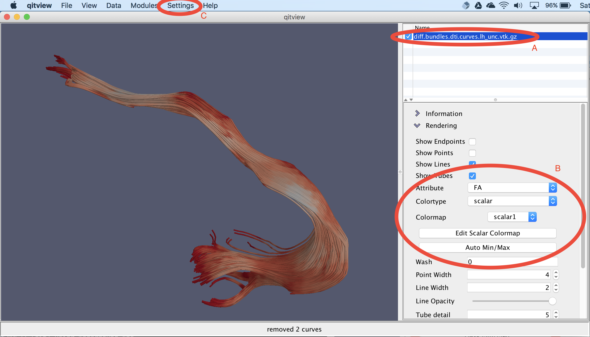
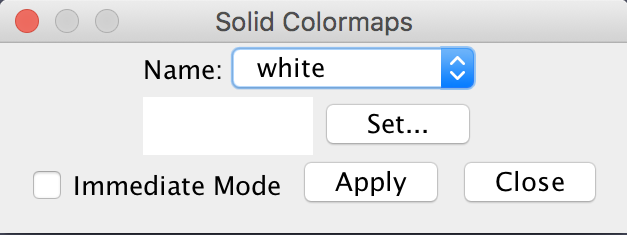
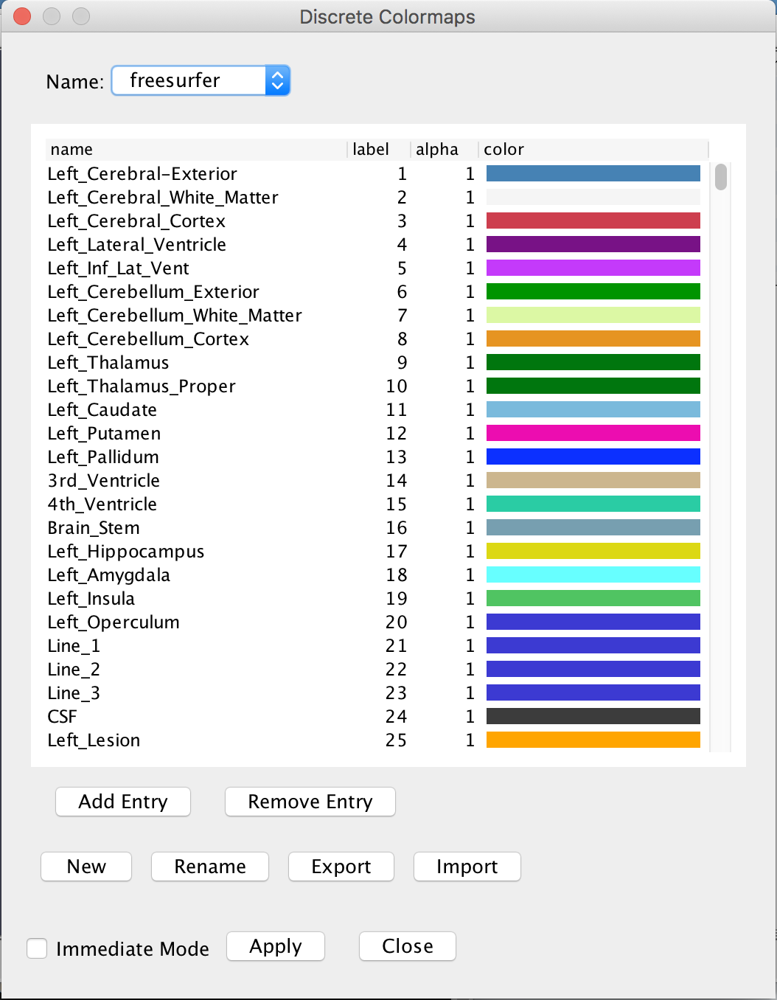
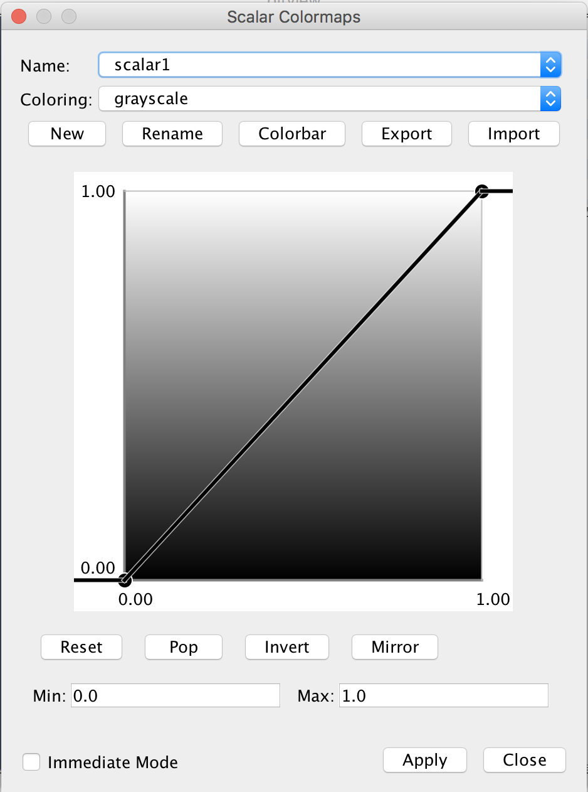
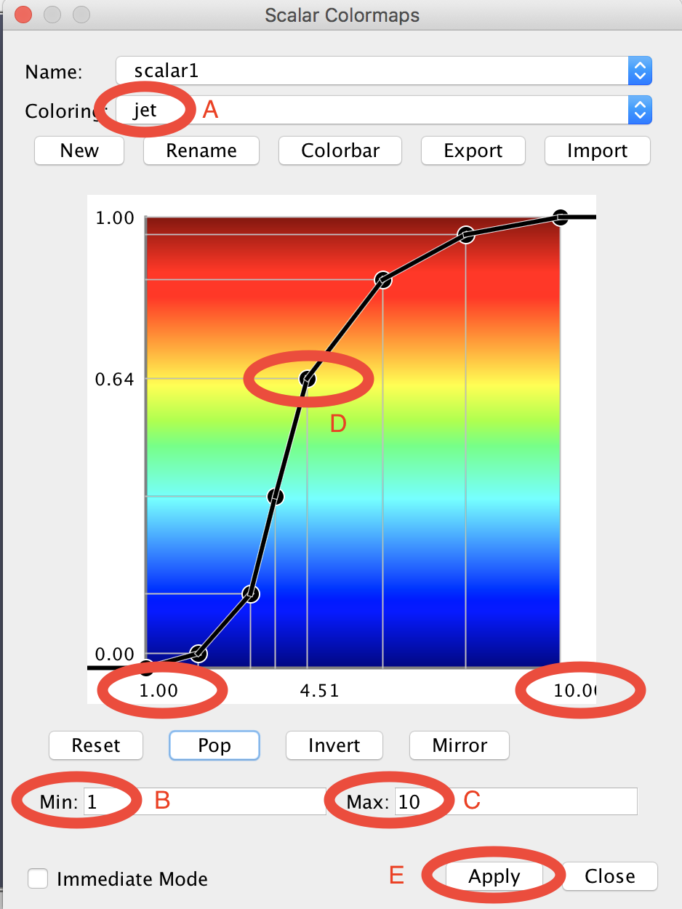

# Applying colormaps in QIT

QIT has a flexible system for coloring data to visualize volumes and vertex attributes on meshes and curves.  At a high level, a colormap is a procedure for creating colors from numerical values associated with a dataset.  There are three basic types of colormaps: `solid`, `discrete`, `scalar`, and `vector`, which each take different types of input data and produce different ranges of colors.  In this section, we well discuss the basic colormap features that are available and how to use them in `qitview`.

## Choosing a colormap

First, we will go over the basic interface for choosing colormaps.

You can use QIT colormaps to visualize many different types of data, but the user interface is meant to be the same whether you are coloring a volume, mesh, or curves object.  The image above shows you you can specify the coloring of a curves object.  First, you check and select the data in the data list (A), then you open a control panel to see the coloring options (B), and optionally edit the colormap in the **Settings** menu (C).  In the control panel, the three most important options are:

* **Attribute**: the vertex attribute used as input to the colormap
* **Colortype**: whether the colormap is `solid`, `discrete`, `scalar`, and `vector`
* **Colormap**: the specific colormap to use (depends on the **Colortype**

So in this example, each vertex of the curves object is colored by extracting an `FA` value, converting it into a `scalar`, and supplying it to the `scalar1` colormap to produce a reddish color.

Each `scalar` colormap has an input range, consisting of a minimum and maximum value.  You can detect these values from your specific dataset by clicking the **Auto Min/Max** button or selecting the **Detect Intensity Range** option in the **Data** menu.

Now that you know how to choose a colormap, we will discuss the three types of colormaps and how you can edit them.

## Solid colormaps

A `solid` colormap is the simplest kind of colormap.  They are defined by a single color that is used to color all possible input data values.  If you are just interested in the structure of your data, or you need to distinguish multiple objects in the view, `solid` colormap may be useful.

{: style="height:50%;width:50%"}

If you open the **Settings>Solid Colormaps** menu, you can edit the available `solid` colormaps (see image shown above).  There are many provided by default, which you can modify as you like.  The image above shows the **Name** combobox for choosing the colormap to edit.  Once you have selected your desired colormap, you can change the associated color by selecting the **Set...** button.  The changes are not automatically applied to the data, so you should then select the **Apply** button to update the rendering.

## Discrete colormaps

A `discrete` colormap is a colormap that takes integer-valued labels and maps them onto a discrete set of colors.  These are useful for visualizing multi-label masks, where each label is associated with a different region-of-interest.  They can also be useful for viewing the results of applying a segmentation algorithm to a mesh, curves, or volume object.

{: style="height:75%;width:75%"}

If you open the **Settings>Discrete Colormaps** menu, you can edit the available `discrete` colormaps.  There are many provided by default, which you can modify as you like.  The menu above shows the **Name** combobox for choosing the colormap to edit.  Once you have selected your desired colormap, can see that there is a collection of names, labels, alpha values, and colors.  You can edit these values by clicking on them.  If you craft a colormap by hand, you may also want to save it to a file using the **Export** button.  You can then load it back in next time you use `qitview` with the **Import** button.  The changes are not automatically applied to the data, so you should then select the **Apply** button to update the rendering.

## Scalar colormaps

A `scalar` colormap is a colormap that takes a floating point number and maps it onto a some continuous range of colors.  These are useful for visualizing model parameters and geometric features of a dataset.  They are also a bit more complex than other colormaps, due to the many ways you can specify the mapping.  Next, we will review how to define your own scalar colormaps.

{: style="height:75%;width:75%"}

If you open the **Settings>Scalar Colormaps** menu, you can edit the available `scalar` colormaps.  There are many provided by default, which you can modify as you like.  The menu above shows the **Name** combobox for choosing the colormap to edit.  Once you have selected your desired colormap, can a panel with many options.  First, there is a normalization function, which is defined by the graph shown above.  Second, there is a coloring, which comes from a fixed set provided with QIT.  The normalization function is a user defined mapping from your dataset to values ranging from zero to one.  You data is first passed through this normalization function, and the resulting values are used to select a color by interpolating the coloring, e.g. `grayscale` shown above.  In practice, you need to specify the normalization function to make a useful colormap by changing the **Min**, the **Max**, and the transfer function.  You can also set the min/max values manually in the colormap editor, or you can set them automatically from the data control panel or the **Data>Detect Intensity Range** menu. The transfer function is an advanced feature.  You can usually leave it as it is, but if you would like to change it, read on.

{: style="height:75%;width:75%"}

The image above shows an advanced colormap that uses custom ranges, a custom
transfer function, and a different coloring.  First, we set the coloring to
`jet` using the **Coloring** combobox (A).  There are dozens of other scalar
colormaps, so please explore then options if you are curious.  The panel
below will then illustrate the coloring you chose.  Then, we set the minimum
(B) and maximum (C) to 1 and 10, respectively.  Then, we specified the
colormap by clicking on the panel and dragging control points around (D).
You can remove the most recently added control point by selecting **Pop**,
remove all control points using **Reset**, invert the transfer function
using **Invert**.  You can also mirror the min/max values using **Mirror**,
e.g. to change the range to -10 to 10.  You can save a PNG image depicting
the colormap by selecting the **Colorbar** option, e.g. this can be used for
making figures.  If you craft a colormap by hand, you may also want to save
it to a file using the **Export** button.  You can then load it back in next
time you use `qitview` with the **Import** button.  The changes are not
automatically applied to the data, so you should then select the **Apply**
button to update the rendering (E).

## Vector colormaps

`vector` colormaps provide a way to convert vector-valued data into colors.  This feature is still under development, so there is only an RGB colormap available at the moment.  This colormap take a 3D vector input and converts the x, y, and z values to red, green, and blue, respectively.  Zero is mapped to the minimum color channel intensity, and one is mapped to the maximum color channel intensity.  If the data is negative, the absolute value is taken, and large values are clamped to one.

