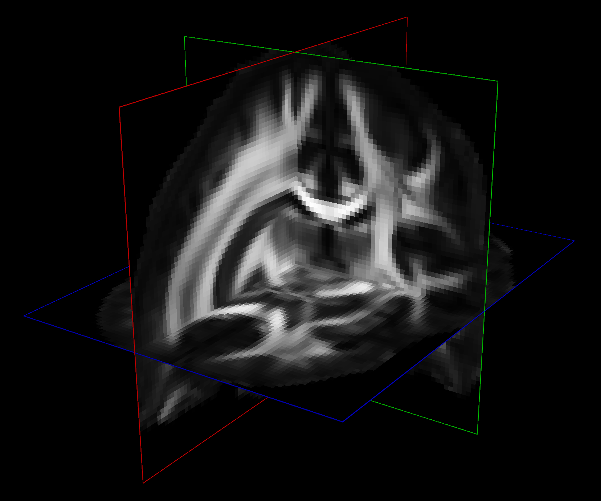
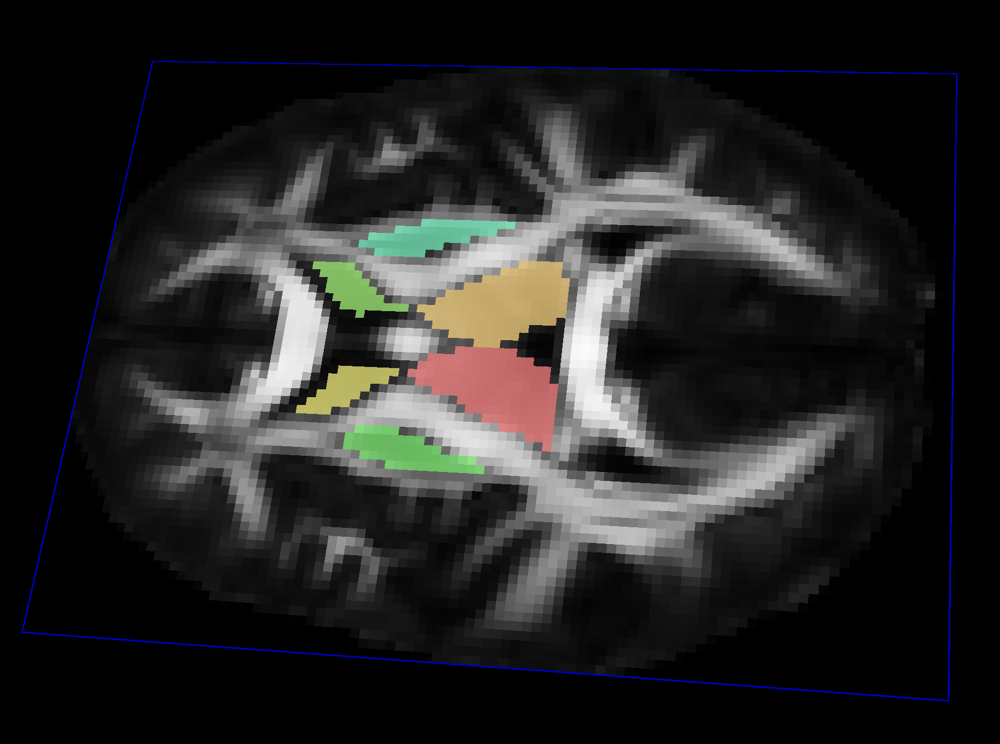
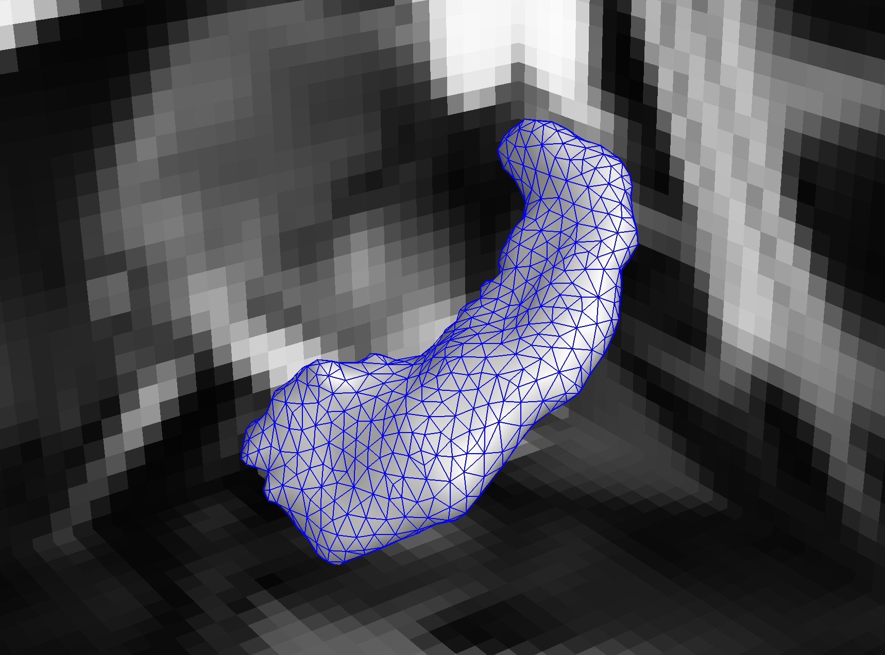
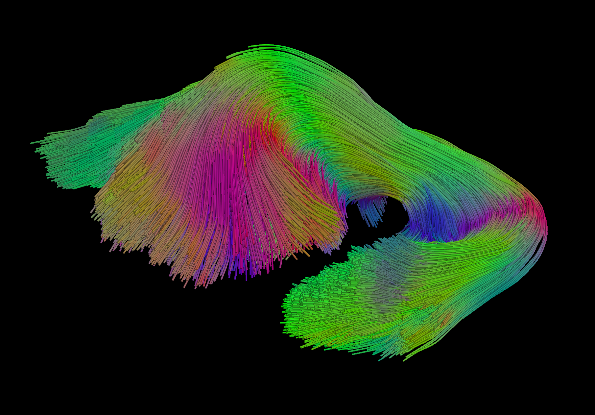
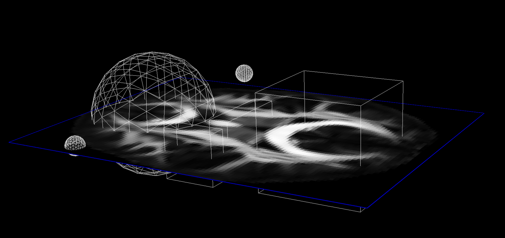
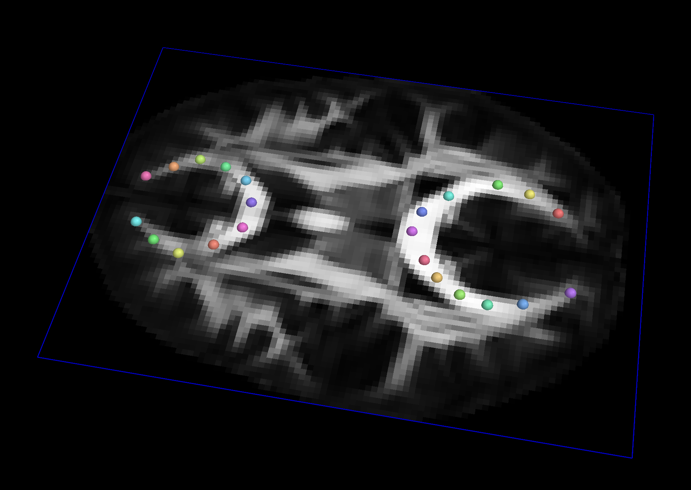

# What types of datasets work with QIT

QIT is primarily designed to work with imaging data, but it also supports a variety of other datatypes that are useful in analyzing imaging data, such surfaces, curves, vectors, spatial transformations, etc. This page describes these various datatypes, how they're used, and what file formats are supported.

## Volume

`Volume` is a dataset representing imaging data, whether that data is planar (2D) or volumetric (3D).  If you have worked with images before, this will be familiar; however, there are several important differences.  Most images encountered day-to-day are essentially a grid of pixels that each have a color, typically encoded by red, green, and blue intensities.  By contrast, a `Volume` represents a 3D dimensional grid of voxels (volume elements) that each have an associated `Vect`.  Sometimes this type of vector-valued volume is called a 4D image, where the fourth dimension identifies an entry of the vector at each voxel.  Another way that a `Volume` is different from a typical image is that it has a spatial coordinate system.  Most images have no need to store a pixel's size or the position of an image in space, but these can be important in scientific imaging.  Therefore, we include a coordinate system that to describe the spatial layout of the 3D grid represented by each `Volume`, which includes:

- a vector indicating the position in space for the first voxel
- a quaternion indicating the rotation of the grid
- a vector indicating the size of the voxel

These provide a connection between voxels on the 3D grid and their positions in 3D space (world coordinates).  This is crucially important when analyzing volumetric data in conjunction with geometric objects and other volumes, which may have a different underlying 3D grid.  Because the coordinate system includes a rotation, it can be quite confusing to discuss voxels and their world coordinates.  To help clarify this, we have adopted the naming conventions for voxels and their positions.  Each voxel is identified by a `Sample` object that stores three indices `(i,j,k)` that correspond to a location on the 3D grid.  The position of each voxel is represented by a `Vect` that stores `(x,y,z)` in world coordinates.

Supported file formats:

 - Input: [NIfTI](http://nifti.nimh.nih.gov/), [VTK](http://www.vtk.org/VTK/img/file-formats.pdf), [ImageIO](http://mindprod.com/jgloss/imageio.html), Text, [UC Davis Stack](https://wiki.cse.ucdavis.edu/keckcaves/imagestacks)
 - Output: [NIfTI](http://nifti.nimh.nih.gov/), [VTK](http://www.vtk.org/VTK/img/file-formats.pdf), [ImageIO](http://mindprod.com/jgloss/imageio.html), Text, [UC Davis Stack](https://wiki.cse.ucdavis.edu/keckcaves/imagestacks), [NRRD](http://teem.sourceforge.net/nrrd/)

## Mask

`Mask` is a dataset for storing volumetric labels.  A `Mask`  has a similar voxel grid structure to a `Volume`, except the value stored at each voxel is instead an `Integer` label.  These labels are meant to discriminate between foreground and background voxels, and well as to indicate multiple labels for region-of-interest analysis.  `Mask` and `Volume` datasets can look similar when saved to disk, but they get treated very differently in QIT.  For example, when rendering an image slice, a `Mask` will use a discrete colormap with different values for each label, while a `Volume` will use a scalar colormap with continuously changing values assigned to pixel intensities.  Furthermore, QIT allows you to manually draw on masks, and some modules require data to be loaded as a `Mask`.  However, it you accidentally load a `Mask` as a `Volume`, there are menu items for converting between the two.

Supported file formats:

- same as `Volume`

## Mesh

`Mesh` is a dataset representing a 3D triangulated surface.  Each `Mesh` consists of a collection of `Vertex` objects, representing the vertices of the triangles, and a collection of `Face` objects representing the triangles themselves.  The 3D position (and any other desired attribute) of the vertex is stored as named `Vect` objects associated with each `Vertex`.  The only required attribute is `coord`, which represents the 3D position of the `Vertex`; otherwise, attributes may have any name and `Vect` dimension.  The triangles are expected to form a manifold surface mesh, meaning they are locally flat and that each edge is shared by at most two faces.  The order of `Vertex` objects in each face reflects the orientation, and the edges of coincident faces should have opposite directions.  A mesh may have many disconnected components or even form a "triangle soup" of unconnected `Face` objects.  They are commonly used to represent boundaries between structures, level sets, and glyphs.  They are especially useful for illustrating 3D structures that are difficult to visualize from volumetric slices.

Supported file formats:

- Input: [VTK](http://www.vtk.org/VTK/img/file-formats.pdf), [GeomView OFF](http://www.geom.uiuc.edu/software/geomview/geomview_6.html#SEC36), [Freesurfer](http://wideman-one.com/gw/brain/fs/surfacefileformats.htm), [MINC OBJ](https://neurohut.blogspot.com/2013/10/how-to-read-minc-obj-file.html), [Freesurfer Mesh](http://www.grahamwideman.com/gw/brain/fs/surfacefileformats.htm)

- Output: [VTK](http://www.vtk.org/VTK/img/file-formats.pdf), [STL](https://en.wikipedia.org/wiki/STL_(file_format)), [GeomView OFF](http://www.geom.uiuc.edu/software/geomview/geomview_6.html#SEC36), [Freesurfer](http://wideman-one.com/gw/brain/fs/surfacefileformats.htm), [MINC OBJ](https://neurohut.blogspot.com/2013/10/how-to-read-minc-obj-file.html), [Lightwave OBJ](https://en.wikipedia.org/wiki/Wavefront_.obj_file)

## Curves

`Curves` is a dataset representing 3D space curves.  A `Curves` object consists of many `Curve` objects, which are each a sequence of points and line segments connecting them (also known as a simple polygonal chain or poly-line).  Each point along each curve also has named `Vect` attributes.  The only required attribute is `coord`, which represents the 3D position of the point.  There's no constraint placed on the spacing between points, and the attributes can have any dimension.  Typically, they are used to represent streamlines, iso-curves, or manually drawn landmark paths.  In particular, tractography produces `Curves` from diffusion MR volumes and include a variety of diffusion-derived attributes.

Supported file formats:

- Input: [http://www.vtk.org/VTK/img/file-formats.pdf VTK], [http://mrtrix.readthedocs.io/en/latest/getting_started/image_data.html MRtrix], [http://trackvis.org TrackVis], [http://www.bic.mni.mcgill.ca/users/mishkin/mni_obj_format.pdf MNI OBJ], [http://graphics.stanford.edu/projects/dti/software/pdb_format.html PDB], [http://jdtournier.github.io/mrtrix-0.2/appendix/mrtrix.html MRtrix], Brown VRL, Text

- Output: [http://www.vtk.org/VTK/img/file-formats.pdf VTK],  [http://mrtrix.readthedocs.io/en/latest/getting_started/image_data.html MRtrix], [http://trackvis.org TrackVis], [http://www.bic.mni.mcgill.ca/users/mishkin/mni_obj_format.pdf MNI OBJ], [http://graphics.stanford.edu/projects/dti/software/pdb_format.html PDB], [http://jdtournier.github.io/mrtrix-0.2/appendix/mrtrix.html MRtrix], Brown VRL, Text, CSV

## Solids

`Solids` is a dataset for represent regions of space using simple geometric objects.  These are typically used for querying other datatypes.  Each `Solids` is a collection of `Sphere` and `Box` objects.  Each `Sphere` has a 3D center and radius, and any point inside the`Sphere` is considered part of the `Solids`.  Each `Box` is a 3D axis-aligned cuboid with a 3D position and some width, length, and height.  Any point inside the `Box` is considered part of the `Solids`.  `Solids` objects are useful for querying spatial data, e.g. by selecting objects that are contained or intersect the solid.  Because these kinds of queries can be repeated many times, the components of a `Solid` are kept simple for efficiency.

Supported file formats:

- Input: JSON
- Output: JSON

## Vects

`Vects` is a dataset representing a list of `Vect` objects.  `Vect` is a
basic vector dataset that represents an array of `double` floating point
values.  This could be 3D positions in space, the intensities of an image,
parameters of some model, etc.   This makes a `Vect` an important building
block for the more complicated datasets described later in this page.  Many
`Vect` operations are supported, including addition, subtraction, scalar
multiplication, dot products, norms, etc.  When a `Vect` represents 3D
spatial quantity, we use a right handed coordinate system when displayed.
There are many uses for collections of vectors, for example, they can
represent spatial landmarks, samples of some function, etc.  Because other
datasets consist of `Vect` objects, `Vects` is also useful for querying and
communication between more complex datasets.  Mathematically, a `Vects`
consisting of 3D `Vect`s can be described:

Supported file formats:

- Input: Text, CSV, RAW (64-bit floating point binary), [Freesurfer Annot](https://surfer.nmr.mgh.harvard.edu/fswiki/AnnotFiles), [Freesurfer Curv](http://www.grahamwideman.com/gw/brain/fs/surfacefileformats.htm)
- Output: Text, CSV, JSON

## Table

`Table` is a dataset representing data organized into rows and named columns.  Each column has a name, each row has a unique identifier, and each element in the table is either a `String` or an empty value `null`. Each row can be extracted to a `Record` object, which represents the row's entries with a key-value mapping.  A `Table` is typically used to store statistical results and lookups that specify the relationship among labels, names, and colors.  In practice, the entries can be a mixture of alphabetical and numerical strings.

Supported file formats:

- Input: Text, CSV, [http://www.grahamwideman.com/gw/brain/fs/surfacefileformats.htm Freesurfer Annot]
- Output: Text, CSV, JSON

## Matrix

`Matrix` is a dataset representing a two dimensional array of `double` floating point values.  They are useful for representing linear transforms, graph connectivity, pairwise distances, and implementing algorithms that use linear algebra.  Many `Matrix` operations are supported, including multiplication, determinants, singular value decompositions, eigenvalue decompositions, etc.

Supported file formats:

- Input: Text, CSV, JSON, DTI-TK affine
- Output: Text, CSV, JSON

## Affine

`Affine` is a dataset representing an affine spatial transformation, which is a linear transformation combined with a translation.  Besides using them to transform `Vects`, they can be composed, inverted, orthogonalized, etc.  They are most commonly used for linear and rigid-body registration of other datasets.  A `Matrix` can be used as an `Affine` as well.

Supported file formats:

- same as `Matrix`

## Deformation

`Deformation` is a dataset representing arbitrary spatial transformations, that is, a mapping from 3D points to 3D points.  The `Deformation` is can be created from either an `Affine` or a sampled function stored in a `Volume`.  If a sampled function is used, the `Volume` representation is interpolated to produce a smooth function.  These are typically used for non-linear registration, e.g. for deforming an image to some typical reference image.

Supported file formats:

- same as `Volume`
- same as `Affine`

## Dataset

`Dataset` is a generic type representing any data that doesn't fit into the above categories.  For example, this could be parameters of a statistical model, such as a Gaussian mixture model.  For simplicity, these are always saved to JSON.  They aren't used by many modules though.

Supported file formats:

- JSON

