# Diffusion MRI analysis with QIT 

This page provides a tutorial for diffusion tensor imaging (DTI) with QIT.
You'll learn how to install QIT, download sample data, estimate and visualize
DTI data, and perform manual seed-based tractography.

## Setup

Before starting the tutorial, you'll need a few things.  First, we will make sure you have the necessary dependencies; then, we will download and install QIT; finally, we will download the sample data.  

## Installation

First, make sure you've installed QIT and its dependencies by following the [[Installation]] instructions.  You won't need the advanced dependencies for this tutorial, so you can skip that.

## Downloading the sample dataset

Next, we'll download the sample dataset, which is available here:

[{: style="height:25px;width:25px"} http://cabeen.io/download/dmri.tutorial.data.zip](http://cabeen.io/download/dmri.tutorial.data.zip)

After you decompress the archive, you should find these files inside:

* `input/dwi.nii.gz`: a diffusion weighted MR image volume
* `input/mask.nii.gz`: a brain mask
* `input/bvecs.txt`: a b-vectors file
* `input/bvals.txt`: a b-values file

There are other files in the archive, but the ones above are strictly required for the tutorial.  This dataset represents a basic 60 direction single shell diffusion MRI scan acquired on a 1.5T scanner.  The dataset is described in more detail [here](https://pdfs.semanticscholar.org/fce5/928fd4519747c642f379208e6779106e6256.pdf)

## Tutorial 

Now that we have installed QIT and downloaded the sample data, we'll go over how to do a basic DTI analysis. 

## Starting QIT

First, we'll start `qitview`.  You can do this by running `qitview` or `qitview.py`by either double clicking in your file explorer or executing them on the command line .  Once you've started the program, you should see console messages about the progress and a window that looks like the image below.  There are three sections to the viewer:

* **Data Stage**: the panel on the left, where data is visualized
* **Data Workspace**: the panel on the top right, where a list of loaded data is shown
* **Data Controls**: the panel on the bottom right, where you control how the selected data is visualized

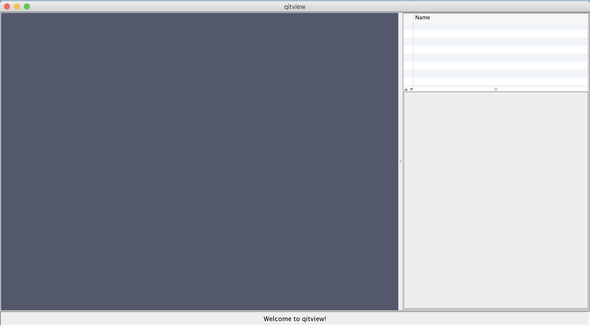

## File loader

Next, we'll open the file loader.  You can find the file loader by clicking the File menu and then clicking "Load Files...":

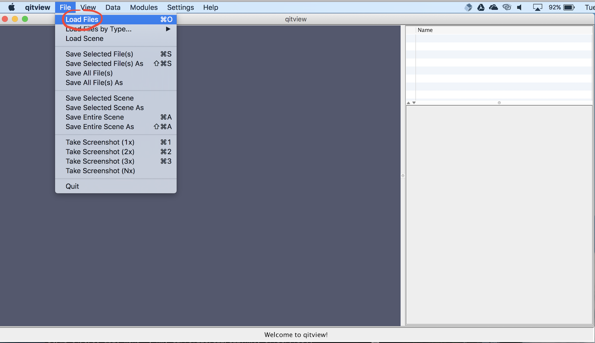

## Load tutorial data

Next, we'll load the sample data for the tutorial.  The file loader lets you open a list of files in batch mode.  You can add files to the list by clicking the **Add more files** button and selecting the file in the file chooser.  Each entry in the list displays the file type and file name.  The file type is automatically detected in this data, so you don't need to change the file type (but be careful about the datatype using QIT later on).  You should add these files to the list:

* `input/bvecs.txt`
* `input/dwi.nii.gz`
* `input/mask.nii.gz`
 
After that, you can load the files by clicking **Load files into workspace**:

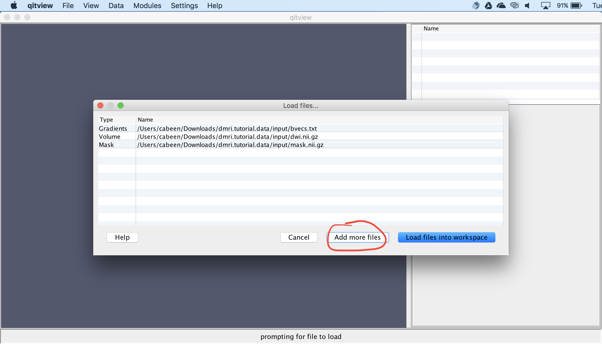

## View the data

Next, we'll visualize the volumetric data.  First, you should select `dwi.nii.gz` and click the box next to it.  You can change the view by clicking on the data stage and dragging the mouse.  Then, you should open the **Slice Rendering** panel and uncheck the boxes next to **Slice I** and **Slice J**.  Now, only an axial slice should be visible.

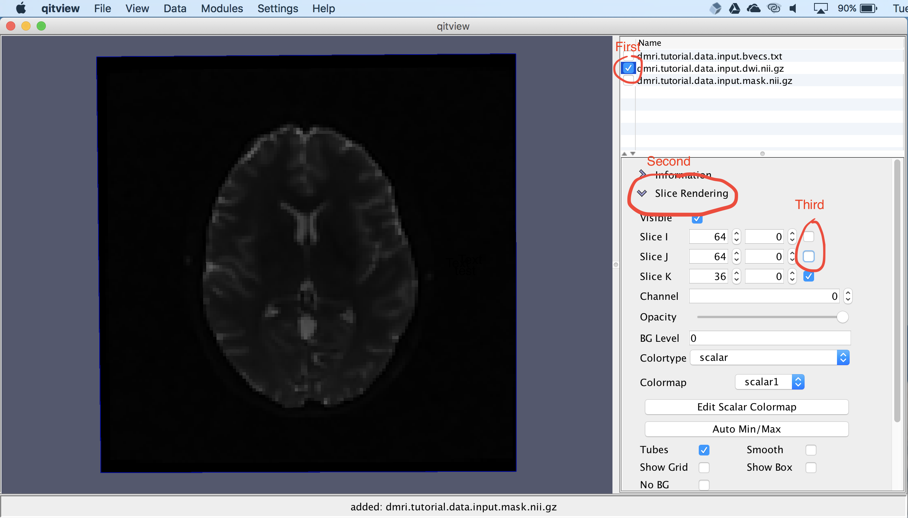

## Opening a Module

Next, we'll do some data processing.  QIT has many modules that each implement a different algorithm.  We'll start by fitting diffusion tensors to the tutorial dataset.  You can open the **VolumeTensorFit** module by opening this menu:

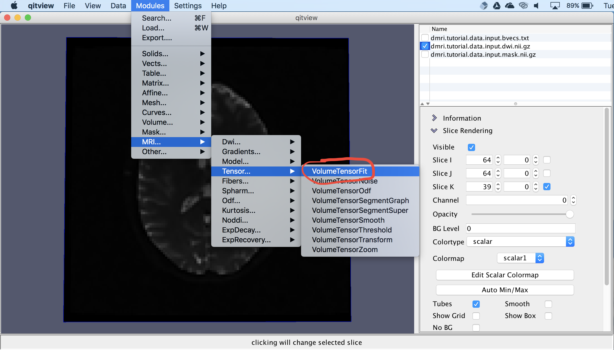

## Fitting Tensors

Now, you should see a window for the **VolumeTensorFit** module.  This provides a way to specify the input data, parameter settings, and the destination for the output.  You should make sure the **input** is set to `dwi.nii.gz` and **gradients** is set to `bvecs.txt`.  Then, you should open the **Optional Input** panel and set **mask** to `mask.nii.gz`.  Then, you should select the **Apply** button.  The module will then ask for a name for the output, which you can set to `models.dti`:

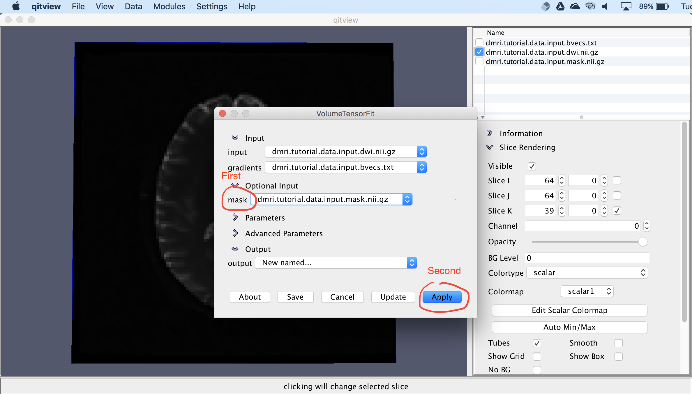

## Glyph Visualization

Now, you should have `models.dti` in your workspace.  Next, we'll create create a glyph visualization.  You should first select `models.dti`, click the box next to it, and expand the **Glyph Rendering** panel.  Then click the **Visible** checkbox and select **TensorEllipsoid** from the dropdown menu:

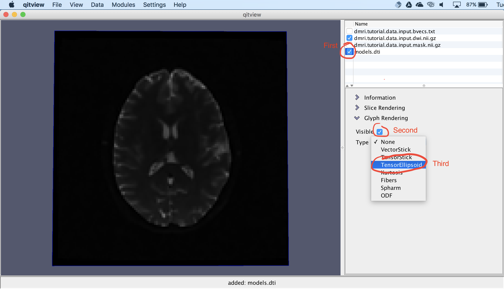

## Tensor Ellipsoid Glyphs

Now, you should see ellipsoid glyphs representing the DTI volume:

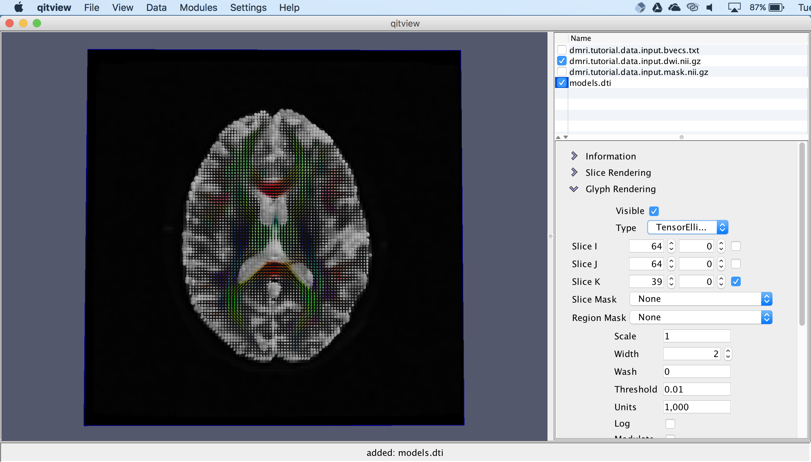

## Extract a tensor model feature 

Next, we'll extract a scalar feature from the DTI volume.  For this, you should open the **VolumeModelFeature** module, set the input to `models.dti`, ensure **feature** is set to `FA`, and select **Apply**.  It will ask for a name for the output, which you can set to `fa`:

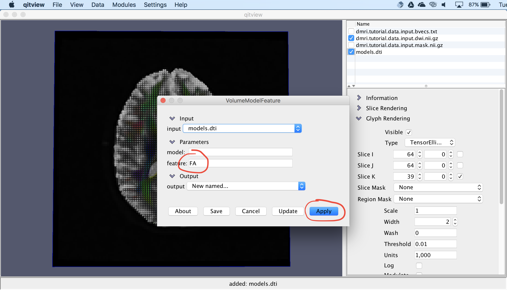

## Visualize fractional anisotropy 

Now, we'll visualize the fractional anisotropy image.  You should first select `fa` in the workspace and check the box next to it.  Then you should open the **Slice Rendering** panel and change the colormap to **scalar2**.  You have to do this because **scalar1** is being used for `dwi.nii.gz` and they have different intensity ranges.

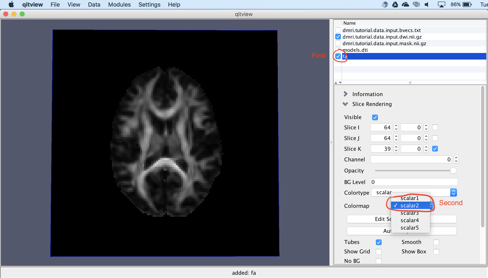

## Create a mask

Next, we'll create a mask for seed-based tractography.  You should Right-Click (or Control+Click) the `fa` volume and select **Create Mask** from the contextual menu.  You will be asked for a name for the new mask, which you can set to `seed`.  This mask will be used for initiating tractography.  In the next section, we'll draw a region in the mask.

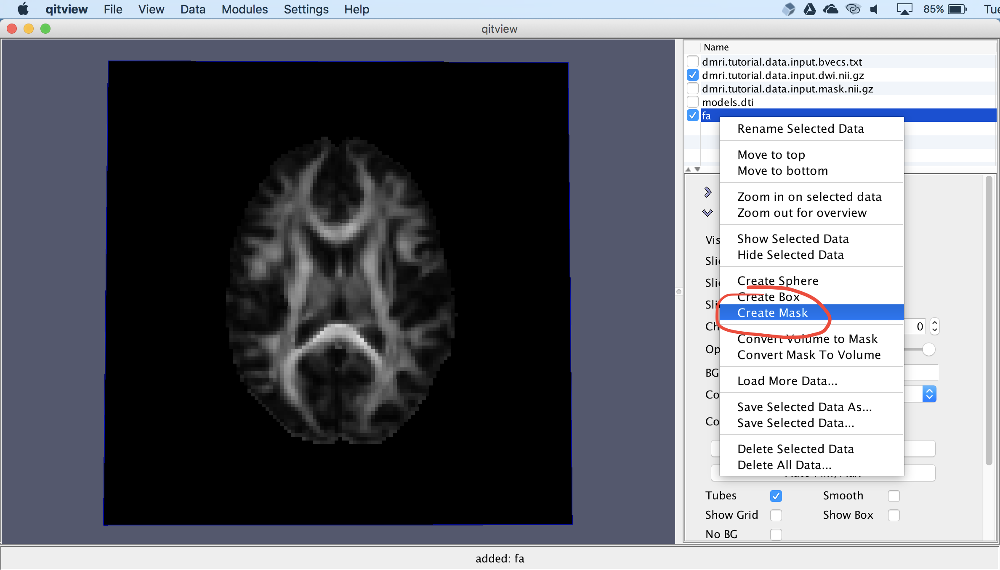

## Draw a mask

Next, we're going to draw a region in the mask.  First, you should select the mask `seed`, make sure the box next to it is checked, and then open the **Drawing** panel.  You can change the drawing mode and characteristics of the stencil with this panel, but for now, you can leave the settings as they are.  Now, you can draw on the mask by dragging the mouse over the image while holding down Alt+Control (or Option+Control on macOS).  If you hover the mouse while holding Alt+Control, it will show you a drawing stencil, and clicking will stamp the highlighted voxels.  You can draw a region like the one shown below.  If you make a mistake, you can hold down Shift+Alt+Control to erase instead.

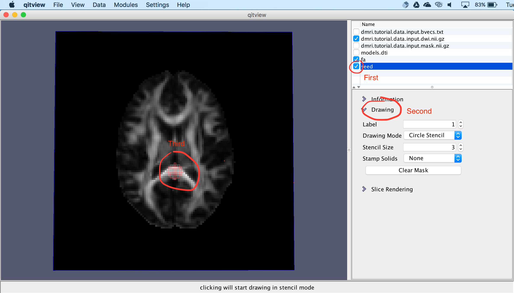

## Extracting tracks

Next, we'll create a tractography model using the seed mask.  First, you should open the **VolumeModelTrackStreamline** module, as shown below.  You should set the **input** to `models.dti`, open the **Optional Input** panel, and set **seedMask** to `seed`.  In the next section, we'll update some more parameters.

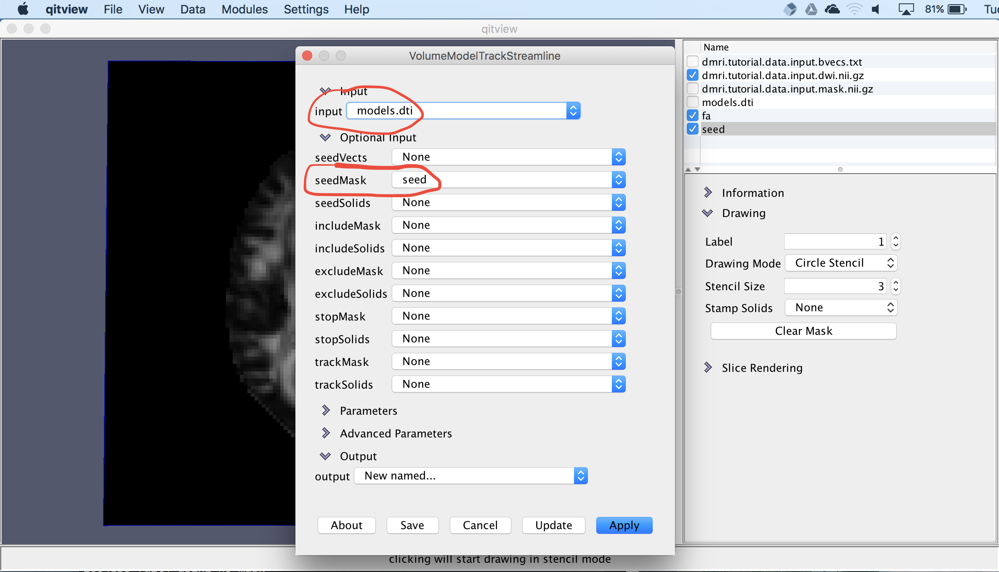

We'll set a couple more parameters.  First, close the **Optional Input** panel and open the **Parameters** panel.  Then, you can set **samples** to `5`, which will specify that five seeds per voxel should be used.  Then, you can set and **min** to `0.15`, which will specify that tracking should only proceed when fractional anisotropy is above 0.15.  Then, you can select "Apply" to create the tracks.  It will ask for a name for the output, which you can set to `tracks`.

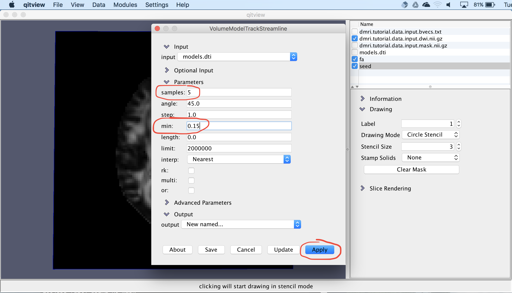

## Visualize tracks

Now, we have tractography curves.  You can show the results by selecting `tracks` and checking the box next to it.  These are 3D curves, so you can rotate the camera to see their shape.  You can also open the **Rendering** panel to change how the curves are visualized.

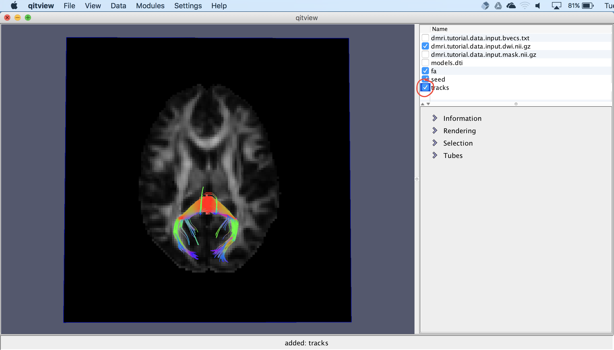

## Conclusion
 
Congratulations!  You've completed your first analysis of diffusion MRI data.  Feel free to experiment with other modules and settings in `qitview` or ask around if you'd like to know more about what else you can do.

