# Exploring Freesurfer data with QIT

This page provides a tutorial for visualizing
[https://surfer.nmr.mgh.harvard.edu/ FreeSurfer] results with QIT.  You'll
learn how to visualize volumetric segmentations of T1 MR images and visualize
surface models of cortical and subcortical structures.

## Setup

Before starting the tutorial, you'll need a few things.  First, make sure
you've installed QIT and its dependencies by following the
[Installation](installation.md) instructions.  You won't need the advanced
dependencies for this tutorial, so you can skip that.

## Downloading the sample dataset

Next, we'll download the sample dataset, which is available here:

[{: style="height:25px;width:25px"} Download fs.tutorial.zip](https://github.com/cabeen/qit/releases/download/data-2021-03-21/fs.tutorial.zip)

After you decompress the archive, you should find these directories:

- `freesurfer`: the subject directory produced by FreeSurfer
- `fsimport`: the FreeSurfer data imported to a QIT-compatible format

There are other files in the archive, but the ones above are strictly required
for the tutorial.  This dataset was processed from a 1mm isotropic MPRAGE
T1-weighted MRI acquired on a 1.5T scanner.  The dataset is described in more
detail 
[here](https://pdfs.semanticscholar.org/fce5/928fd4519747c642f379208e6779106e6256.pdf)

## Optional: Converting FreeSurfer results

FreeSurfer uses its own file formats, and to visualize the results in QIT, you have to import them to more general purpose file formats.  To simplify the tutorial, we have already done this for you and saved the results to `fsimport`.  However, if you want to visualize other datasets, you will have to similarly import that data using a command like this:

```
qit FreesurferImport --input freesurfer --brain --segmentations --surfaces --output fsimport
```

This program assumes you've installed FreeSurfer on your machine and put the binaries on the path, like described in the advanced section of the [[Installation]] page.

## Tutorial

Now that we have installed QIT and downloaded the sample data, we'll go over how to visualize the volumetric and geometric models produced by FreeSurfer.

## Starting QIT

First, we'll start `qitview`.  You can do this by running `qitview` or `qitview.py`by either double clicking in your file explorer or executing them on the command line .  Once you've started the program, you should see console messages about the progress and a window that looks like the image below.  There are three sections to the viewer:

- **Data Stage**: the panel on the left, where data is visualized
- **Data Workspace**: the panel on the top right, where a list of loaded data is shown
- **Data Controls**: the panel on the bottom right, where you control how the selected data is visualized

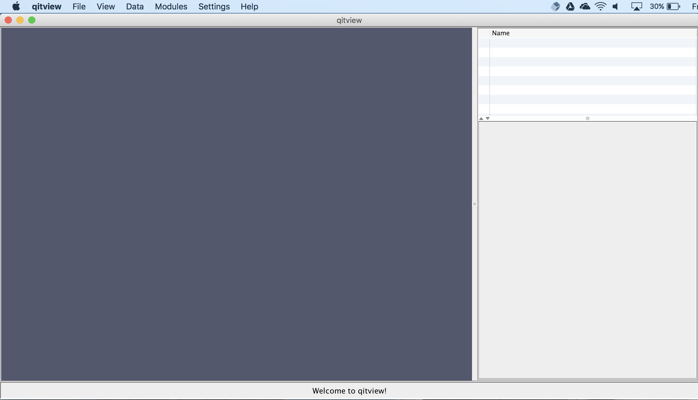

## File loader

Next, we'll open the file loader.  You can find the file loader by clicking the File menu and then clicking "Load Files...".  Next, we'll load the sample data for the tutorial.  The file loader lets you open a list of files in batch mode.  You can add files to the list by clicking the **Add more files** button (A) and selecting the file in the file chooser.  Each entry in the list displays the file type and file name.  You should add these files to the list:

- `fsimport/brain.nii.gz` set to datatype **Volume**
- `fsimport/aparc+aseg.nii.gz` set to datatype **Mask**
- `fsimport/scgm/rois.nii.gz` set to datatype **Mask**
- `fsimport/surfaces/lh.pial.vtk` set to datatype **Mesh**
- `fsimport/surfaces/rh.pial.vtk` set to datatype **Mesh**
 
After that, you need to set the file types to the types listed above (B).  Then, you can load the files by clicking **Load files into workspace** (C):


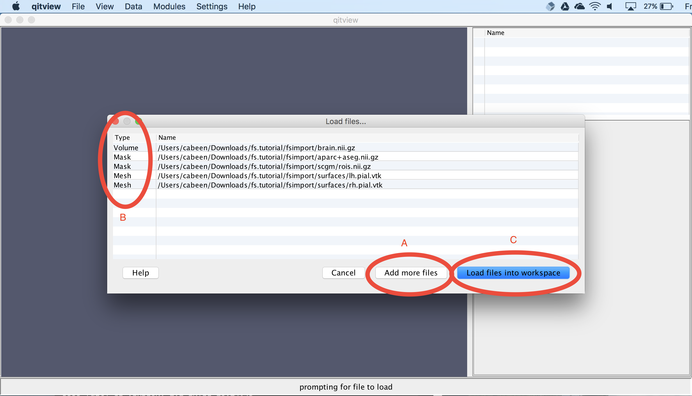

## View the T1-weighted MRI

Next, we will visualize the input T1-weighted MRI dataset.  First, click the box next to `brain.nii.gz` (A).  Next, we will isolate a coronal slice by first unchecking the **Slice I** and **Slice K** checkboxes (B) and then changing the **Slice J** index to 155 (C):

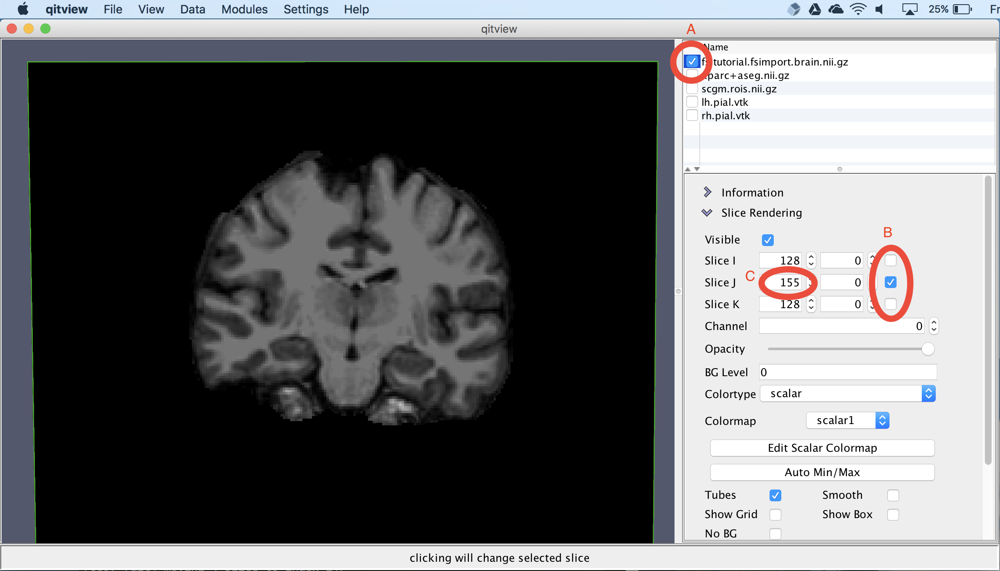

## View the volumetric segmentation

Next, we'll visualize the volumetric segmentation.  First, you should select `aparc+aseg.nii.gz` and click the box next to it.  Next, you should change the colormap to `freesurfer`.  Now you should see an overlay segmentation on the T1 image:

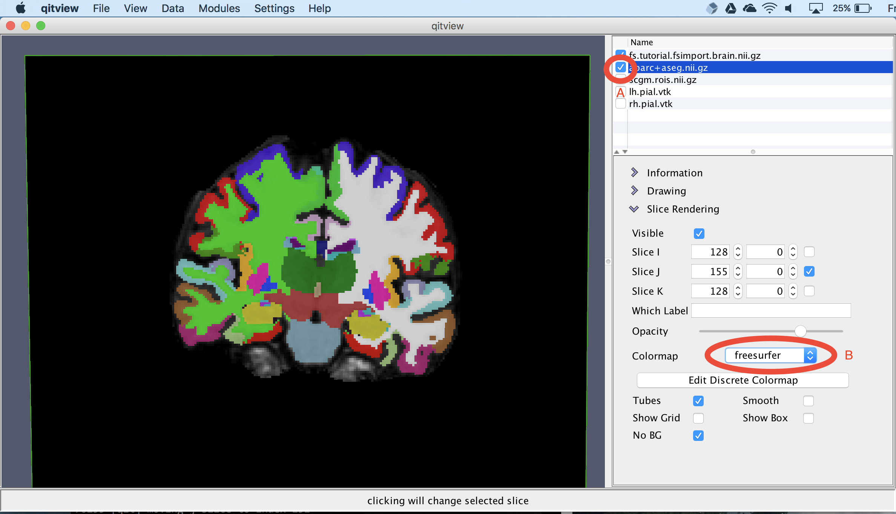

## Extract subcortical surfaces

Next, we'll visualize the subcortical structures.  First, you should select `scgm.rois.nii.gz` and click the box next to it.  Then, you should open the module **MaskMarchingCubes**.  You should set the input to `scgm.rois.nii.gz` (A) and select the **Apply** button (B).  The module will then ask you for a name for the new mesh object, which you can call `scgm`:

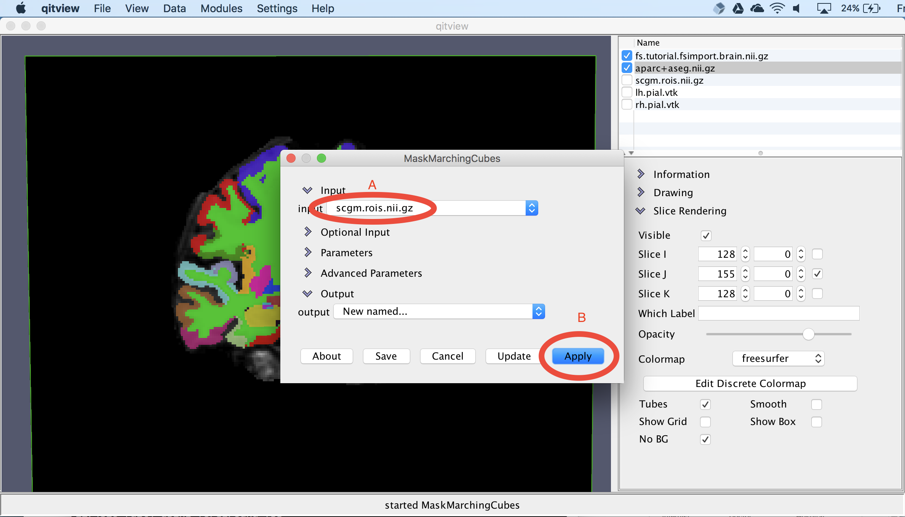

## Smooth the subcortical surfaces

The surface models created by the previous step are jagged due to aliasing, so next, we'll smooth surface to reduce the discretization effects.  First, you should open the model **MeshSmooth**.  You should ensure the input is `scgm` (A) and then set the output to `scgm`.  This will replace the original `scgm` with the new smoothed version.  Then select the **Apply** button to run the module (C):

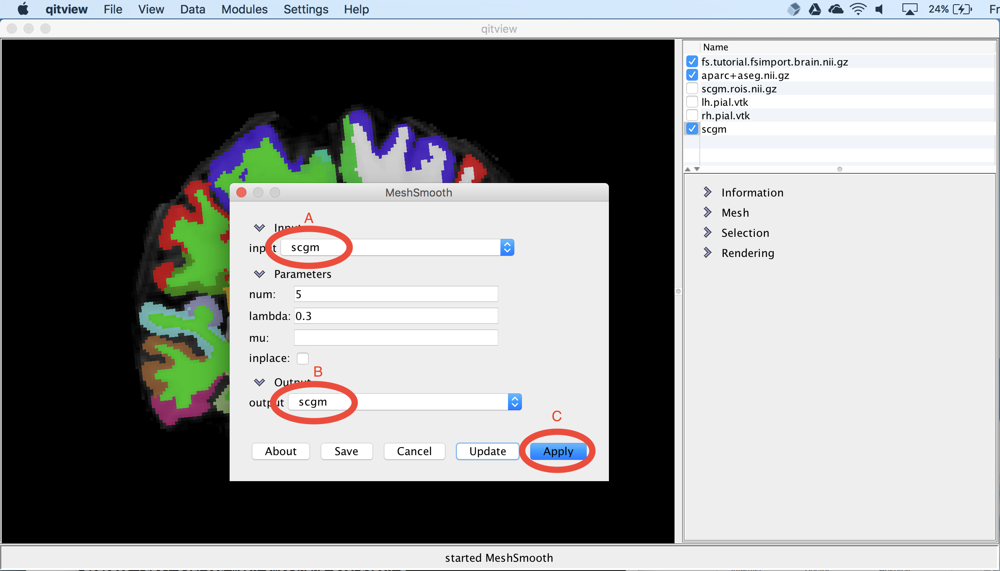

## View the subcortical surfaces

Next, we will visualize the surface models of the subcortical structures.  First, you should select the `scgm` object and select the box next to the name (A).  This needs some color to distinguish the different structures, so we can change the **Attribute** to `label` (B) and then change the **Colormap** to `discrete` (C).  This should now show meshes with distinct colors for each structure:

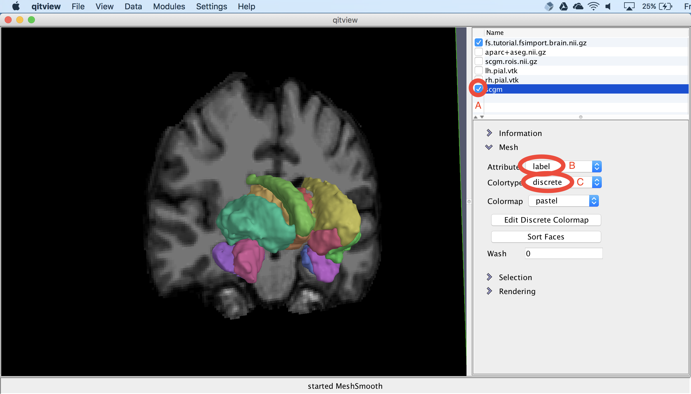

## View the cortical surface

Next, we will visualize the cortical surface.  First, you should hide the other objects by unchecking their visibility boxes.  Then, you should check the boxes next to `lh.pial.vtk` and `rh.pial.vtk.`.  This should show the two hemispheres:

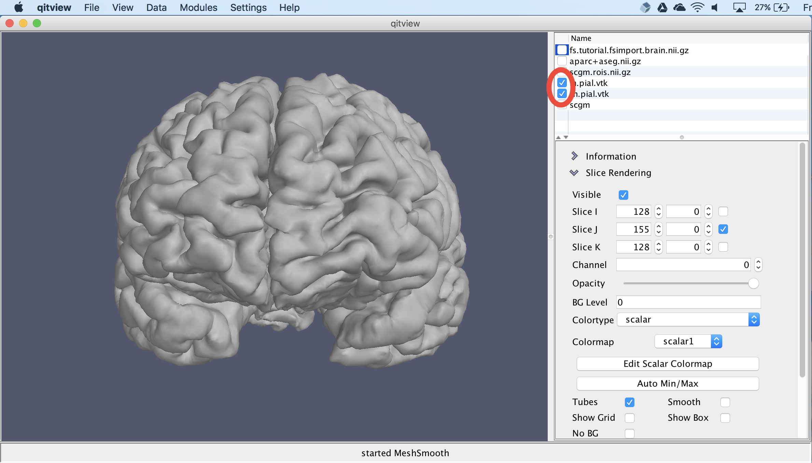

## View cortical thickness

Next, we will visualize cortical thickness on the surface.  First, you should change the **Attribute** to `thickness` (A), then change the **Colortype** to `scalar` (B), and then change the **Colormap** to `scalar2` . We need to change the scalar colormap because the T1 MRI is being visualized using `scalar1`.  Next, you should select the **Auto Min/Max** button to adjust the colormap range to match the cortical thickness values.  Currently, it's showing grayscale, so you should select the **Edit Scalar Colormap** to pick something else (E):

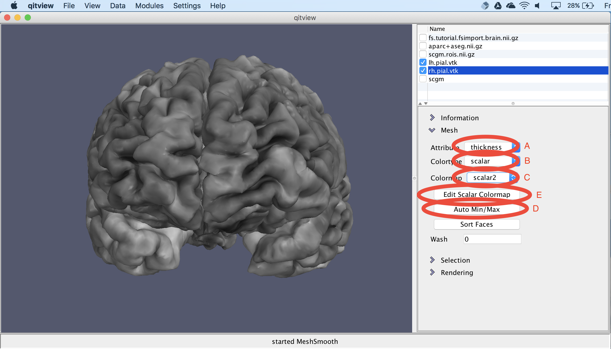

## Change the cortical thickness coloring

Now, you should see a colormap editor window.  You should first change the **Name** to `scalar2` (A) and then change the **Colormap** to `diverging` (B).  You can also experiment with other colormaps besides that one.  Then, to apply the colormap, you should select the **Apply** button (C):
  
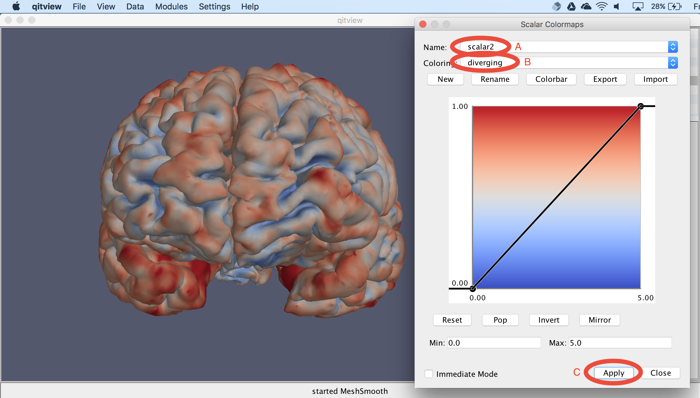

## View the cortical parcellation

Finally, we will view the cortical parcellation from the Desikan-Killiany atlas.  You should first make sure the `lh.pial.vtk` object is selected.  Then, you should change the **Attribute** to `aparc` (A), and change the **Colortype** to `discrete` (B), and then change the **Colormap** to `freesurfer`.  You should then see regions visualized on the cortical surface:

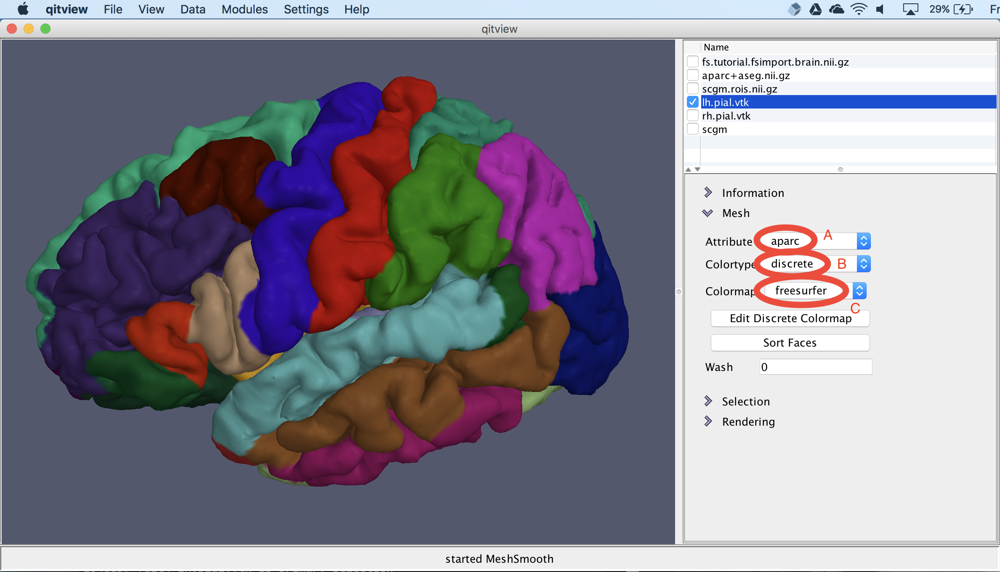

## Extract statistics (Optional)

You can also use QIT to extract statistical tables from a FreeSurfer subject directory:

```
$ qfsmeas freesurfer fsmap
```

The output directory `fsmap` will contain a number of CSV files storing morphometric variables for a variety of cortical, white matter, and subcortical structures.  These are a bit more friendly for loading data into R, etc. than what FreeSurfer provides by default.  For example:

```
$ ls fsmap
BA.area.csv                aparc.a2009s.volume.csv
BA.meancurv.csv            aparc.area.csv
BA.thickness.csv           aparc.meancurv.csv
BA.volume.csv              aparc.thickness.csv
aparc.a2009s.area.csv      aparc.volume.csv
aparc.a2009s.meancurv.csv  aseg.stats.csv
aparc.a2009s.thickness.csv wmparc.stats.csv
```
```
$ head fsmap/aseg.stats.csv
name,value
Left-Lateral-Ventricle,4355
Left-Inf-Lat-Vent,289
Left-Cerebellum-White-Matter,12850
Left-Cerebellum-Cortex,42203
Left-Thalamus-Proper,6235
Left-Caudate,3086
Left-Putamen,5655
Left-Pallidum,1594
3rd-Ventricle,677
```

## Conclusion

Congratulations!  You've completed the tutorial for visualizing FreeSurfer results.  Feel free to experiment with other surface attributes and settings in `qitview` or ask around if you'd like to know more about what else you can do.

