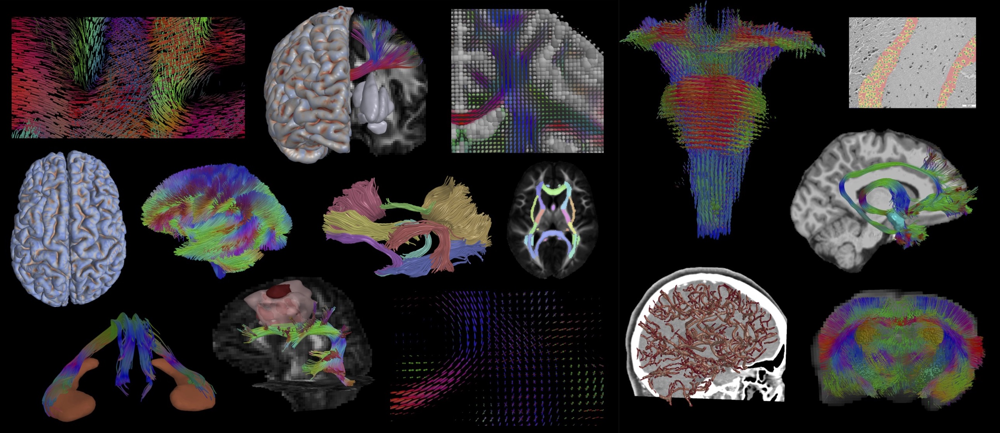

# The Quantitative Imaging Toolkit (QIT)

Welcome to the main documentation site for the Quantitative Imaging Toolkit
(QIT), a software package for visualization, exploration, and analysis of
neuroimaging datasets. You can download the latest version on the
[Installation](install.md) page or the links below:

[{: style="height:25px;width:25px"} Download QIT for MacOS](https://github.com/cabeen/qit/releases/download/latest/qit-build-mac-latest.zip)
&nbsp;
&nbsp;
[{: style="height:25px;width:25px"} Download QIT for Windows](https://github.com/cabeen/qit/releases/download/latest/qit-build-win-latest.zip) 
&nbsp;
&nbsp;
[{: style="height:25px;width:25px"} Download QIT for Linux](https://github.com/cabeen/qit/releases/download/latest/qit-build-linux-latest.zip)

## What is QIT? 

QIT is a software package of computational tools for the modeling, analysis,
and visualization of scientific imaging data.  It was specifically developed
for tractography and microstructure analysis of diffusion magnetic resonance
imaging datasets, but it has capabilities that are generally useful for other
imaging modalities as well.  It supports many different data types, including
multi-channel volumetric datasets, multi-label masks, curves, triangle meshes,
geometric primitives, tabular data, and spatial transformations.  QIT provides
an application called `qitview` for interactive 3D rendering and data analysis,
as well as, a suite of command line tools available through a program named
`qit` that provides a way to do batch processing and scripting.  In addition,
QIT also provides ways to integrate of these tools into grid computing
environments and scientific workflows.

## Who develops QIT?

QIT is designed, implemented, and supported by Ryan P. Cabeen, PhD as a
software platform for neuroimaging research.  You can learn more about
research applications of QIT at [https://cabeen.io](https://cabeen.io).
Development started in 2012 to support neuroimaging projects in the lab of
[David H. Laidlaw](http://cs.brown.edu/people/dhl/) in the [Department of
Computer Science at Brown University](http://cs.brown.edu).  Currently, QIT
is actively being developed and applied in the lab of Dr. Arthur Toga at the
USC [Laboratory of Neuro Imaging Resource](http://resource.loni.usc.edu/).

This work has been supported by the Brown University Graduate Award in Brain
Science,  National Institutes of Health (grant number P41EB015922), and the
Chan Zuckerberg Imaging Scientist Program through grant number 2020-225670
from the Chan Zuckerberg Initiative DAF, an advised fund of Silicon Valley
Community Foundation. 

Comments, criticism, and concerns are appreciated and can be directed to
[cabeen@gmail.com](mailto:cabeen@gmail.com).
