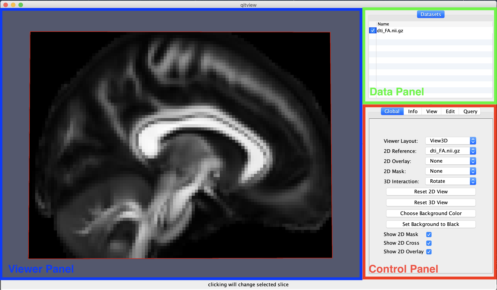
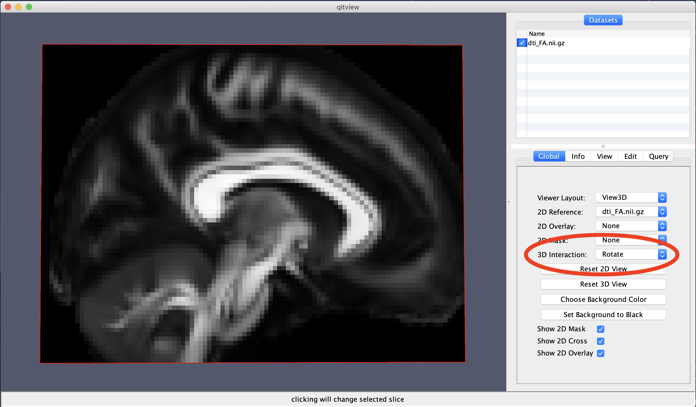

# Interacting with data in QIT

`qitview` is a 3D data exploration tool that supports many ways to interact
with data.  The following sections describe `qitview`'s interaction model
and list the various specific interactions that are available for each
[Datasets](datasets.md).

## Interaction Model

`qitview`'s user interface consists of three main panels (shown above): the
**Data Panel**, the **Control Panel**, and the **Viewer Panel**.  You can
interact with all of these panels to change how your data is rendered on the
screen, but you should know a little bit about how they work to use them
effectively.  

The **Data Panel** is important for choosing which [Datasets](datasets.md)
you are controlling, specifically you have to select the item in the list so
that it is ''highlighted''.  Once highlighted, the **Control Panel** will be
updated to show controls for that specific dataset under the **Info**,
**View**, and **Edit** tabs.  After highlighting a dataset, the **Viewer
Panel** will also accept mouse interactions that are applied only to the
selected dataset.  For example, if you use a mouse action for drawing, it
will only apply to the selected dataset.  There are also a few ''global''
mouse interactions in the **Viewer Panel** that are not applied to the
highlighted datasets (for example rotation, panning, and zooming), and these
are clearly indicated below.  

When using the mouse in `qitview`, you can choose among different
interactions by pressing mouse buttons, by moving the mouse, and holding
down modifier keys while you do either.  The **Primary**, **Secondary**, and
**Tertiary** mouse buttons are described below, and these are the same as
the **Left**, **Right**, and **Middle** buttons on a typical mouse.  When
moving the mouse, there are a few actions: a **Hover** of the pointer over a
data object, a **Click** of a mouse button on a specific part in the scene,
or a **Drag** of the pointer across the viewer panel while holding down the
mouse button.  You can also modify the mouse action by holding either
**Control**, **Shift**, **Alt**, or some combination of them (note: on
macOS, you can use **Option** instead of **Alt**).  Besides using the mouse,
there are also menus and keyboard shortcuts that can change the view and
modify datasets.  The keyboard shortcuts are discussed below, and you are
encouraged to  explore the menu options, which can be found both on the
system menu bar and in contextual menus that can be shown by right clicking
on specific datasets.  So that's the big picture for interacting with data
in `qitview`. Next, we'll dig into the various specific interactions that
are available.

## Global Interactions

You can use the following interactions to change the camera:

- ***Primary Button + Drag***: **Rotate** the camera

- ***Control + Primary Button + Drag***: **Zoom in the camera** (translate it towards the stage)
- ***Secondary Button + Drag***: **Zoom in the camera** (translate it towards the stage)

- ***Shift + Primary Button + Drag***: **Pan the camera** (translate in the plane orthogonal to the view)

- ***Tertiary Button + Drag***: **Pan the camera** (translate in the plane orthogonal to the view)

You can also **double click** the primary mouse button on the 3D model in the **Viewer Panel** and that will select it in the **Data Panel**.  There are data-specific interactions that are only available when a data object is selected in the list, so the double-click feature will allow you to quickly select and then interact with your data object of choice.

## Dataset interactions

The following interactions will be applied only to the dataset that is highlighted in the **Data Panel**.  While the options are complex, one general rule is that **Alt** is used for mouse interactions that are applied to the highlighted dataset, and otherwise, they mouse interaction is global in nature.

### Volume Interactions

- ***Alt + Drag***: **Slice the volume** (based on where you clicked).  This will show a red line indicating which slice is being modified.
- ***Alt + Shift + Hover***: **Query the coordinates and data value** of the selected voxel.  This will show red crosshairs and box around the selected voxel.

- ***Right/Up Arrow***: **Increment the slice** of the selected `Volume` or `Mask`.
- ***Left/Down Arrow***: **Decrement the slice** of the selected `Volume` or `Mask`.
- ***Shift+Right/Up Arrow***: **Fast Increment the slice** of the selected `Volume` or `Mask`.
- ***Shift+Left/Down Arrow***: **Fast Decrement the slice** of the selected `Volume` or `Mask`.

### Mask Interactions

- ***Alt + Drag***: **Slice the volume** (based on where you clicked).  This will show a red line indicating which slice is being modified.
- ***Alt + Shift + Hover***: **Query the coordinates and data value** of the selected voxel.  This will show red crosshairs and box around the selected voxel.
- ***Alt + Control + Drag***: **Draw on the `Mask`**.  Depending on the drawing mode, this will show either a stencil grid or the freehand polygon path.  The drawing label and mode can be specified in the `Mask` control panel. 
- ***Alt + Shift + Control + Drag***: **Erase the labels of the `Mask`**.  Depending on the mode, this will show either a black stencil or a black freehand polygon path.

### Solids Interactions

- ***Alt + Drag***: **Move the selected solid** (i.e. a translation).  A red circle will be shown in the center of the solid to indicate which one was selected.
- ***Alt + Shift + Drag***: **Resize the solid** (i.e. change the sphere radius or box dimensions).  If you select a sphere, it will change the radius, and if you select a box, it will grow or shink the side you selected.  A red line will indicate what you selected.
- ***Alt + Control + Click***: **Create a new solid**.  The type and size of the new solid can be specified in the control panel.  A blinking red circle will be shown before clicking the mouse to indicate where the new solid will be placed.
- ***Alt + Shift + Control + Click***: **Remove the selected solid**.  Before you click the mouse, the selected solid will blink to indicate it is about to be removed.

### Curves Interactions

- ***Alt + Shift + Drag***: **Query the curves**.  The selected curves will be highlighted in red.
- ***Alt + Shift + Control + Drag***: **Remove the selected curves**.  Before you click the mouse, the selected curves will be highlighted in red.

### Mesh Interactions

- ***Alt + Shift + Hover***: **Query the mesh vertices**.  The size of the query can be specified in the control panel.  The selected vertices will be highlighted in red.
- ***Alt + Control + Drag***: **Show only the selected mesh component**.  This assumes the mesh has a label attribute, which is specified in the `Mesh` control panel.
- ***Alt + Shift + Control + Drag***: **Hide the selected mesh component**.  This assumes the mesh has a label attribute, which is specified in the `Mesh` control panel.

### Vects Interactions

 - ***Alt + Drag***: **Move the selected vect** (i.e. a translation).  A red circle will be shown in the center of the vect to indicate which one was selected.
 - ***Alt + Control + Click***: **Create a new vect**.  A blinking red circle will be shown before clicking the mouse to indicate where the new vect will be placed.
 - ***Alt + Shift + Control + Click***: **Remove the selected vect**.  Before you click the mouse, the selected dot will blink to indicate it is about to be removed.

## Manually setting the interaction mode

If for any reason you have difficulty using the mouse and keyboard at the same time, you can also specify the interaction mode using the mouse.  You can find this **3D Interaction** combo box in the **Global** tab of the **Control Panel**.  This will include camera interactions, such as `Rotate`, `Pan`, and `Zoom`.  You can quickly reset the interaction mode by pressing the **Escape** key.   Note, the **3D Interaction** menu will change based on the dataset you have highlighted for example, when a volume is highlighted, there is an interaction mode for changing the image slice.

