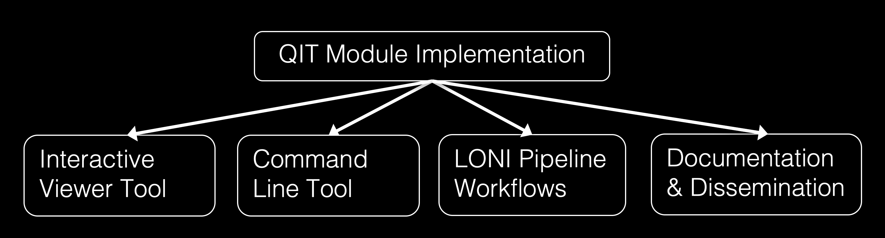

# What are QIT modules? 

QIT includes a module framework for making making it easy to analyze data.
This page describes how modules are used, outlines the basic components of the
module framework, and provides an example of a module.  If you're not
interested in the software development aspects, you can probably just read the
first section.

## Why use a `Module`?

The QIT module system is meant to make it easier to use the many useful data
processing algorithms that are out there.  Many researchers develop
sophisticated new methods, but unfortunately, they often end up as prototypes
that aren't more widely used.   The module framework is an attempt to bridge
the gap between these methods and people who can use them in their research.
The basic idea is to provide a simple interface for implementing an algorithm
that doesn't require the developer to worry about file formats, user
interfaces, etc.



All of these things are automatically handled by QIT once a `Module`
has been implemented, making it easy to share a new tool with a wider audience.
Any QIT `Module` can be run on the command line, applied to data
interactively in `qitview`, or run on the
[http://pipeline.loni.usc.edu LONI Pipeline].  In addition, documentation can
be made from a `Module` and a preferred set of parameter settings
can be saved for later use or archival purposes.

## What is a `Module`?

A `Module` is an object that processes data in some way.  That may
sound too general to be useful, but there are a number of elements common to
each `Module` that make life easier for both software developers and
users. From the perspective of a developer, a `Module` makes life
easier by providing a framework for implementing both simple and complex
algorithms that use any of the available [Datasets](datasets.md).  This framework isn't
specific to any file format, so any new `Module` automatically
supports the file formats listed in for each of the [Datasets](datasets.md).  It also
provides automatically generated command line and graphical user interfaces for
using the `Module`.  For command line applications, each
`Module` will have an automatically generated usage page and option
parsing available.  For graphical applications, each `Module` will
be listed in 3d data viewer `qitview`, along with a dialog for
controlling how the it operates on data loaded in the viewer.  For the user,
this framework also simplifies the analysis of data by providing a consistent
interface across algorithms, reducing the need to learn how to use each tool as
it comes along.  It also means that an algorithm is more widely available than
if it was developed as an independent program or as a `MATLAB`
script, which are not typically integrated into data viewers or support many
file formats.  Finally, each `Module` also supports meta-data that
includes the author, associated publications, and plain english descriptions.

## What makes up a `Module`?

Each `Module` has some number of fields with annotations to indicate
how they should be treated.  There are three main types:

- `@ModuleInput`: a [Datasets](datasets.md) object that will be processed, which is provided by the user when they run the module
- `@ModuleParameter`: a numerical, string, or boolean parameter, which is provided by the user
- `@ModuleOutput`: a [Datasets](datasets.md) object that will be the result, which will be received by the user

There can be multiple `@ModuleInput` and `@ModuleOutput` fields, each of which belongs to one of the types listed in `Datatypes`.  There can be any number of `@ModuleParameter` components, but they must also be primitive types, such `Integer`, `Double`, `String`, or `Boolean`. `@ModuleParameter` field can also have default values.  There are also modifiers on fields, including:

- `@ModuleOptional`: a component is not required for the `Module` to run
- `@ModuleAdvanced`: a component is not typically modified (only used when making documentation)

There can also be annotations for provenance, for example:

- `@ModuleDescription`: a plain english description of a module or field
- `@ModuleAuthor`: the person implementing the `Module` (not necessarily the author of the underlying algorithm or paper)
- `@ModuleCitation`: a reference that should be cited when using this module in analysis for academic publication

Beyond this, each `Module` also contains the procedures for data processing, which is why you would use the `Module` in the first place!

## What is an example of a `Module`?

Below, we provide an example `Module` named `VolumeThreshold` that thresholds a `Volume` to produce a binary `Mask`.  While there are many more complex examples, this demonstrates the basic features of a `Module`.

The code for the module looks like this:

```
@ModuleDescription("Threshold a volume to make a mask")
@ModuleAuthor("Ryan Cabeen")
public class VolumeThreshold implements Module
{
    @ModuleInput
    @ModuleDescription("input volume")
    public Volume input;
    
    @ModuleInput
    @ModuleDescription("a mask restricting which voxels are processed")
    public Mask mask;
    
    @ModuleParameter
    @ModuleDescription("threshold value")
    public double threshold = 0.5;
    
    @ModuleOutput
    @ModuleDescription("output mask")
    public Mask output;

    public VolumeThreshold run()
    {
        Mask out = new Mask(this.input.getSampling());

        for (Sample sample : this.input.getSampling())
        {
            if (this.input.valid(sample, this.mask))
            {
                double value = this.input.get(sample, 0);
                if (value >= this.threshold)
                {
                    out.set(sample, 1);
                }
            }
        }
        
        this.output = out;

        return this;
    }
}
```

The command line interface for this module looks like this:

```
$ qit VolumeThreshold --help

Name:

  VolumeThreshold

Description:

  threshold a volume to make a mask

Required Arguments:

  --input <Volume>

    input volume

  --output <Mask>

    output mask

Optional Arguments:

  --mask <Mask>

    a mask restricting which voxels are processed

  --threshold <double>

    threshold value (Default: 0.5)

Author:

  Ryan Cabeen
```

The graphical user interface looks like this:

{: style="height:50%;width:50%"}

Note: the module dialog supports tooltips, which means if you hover the mouse over a `@Parameter` it will pop up a box showing more information.

