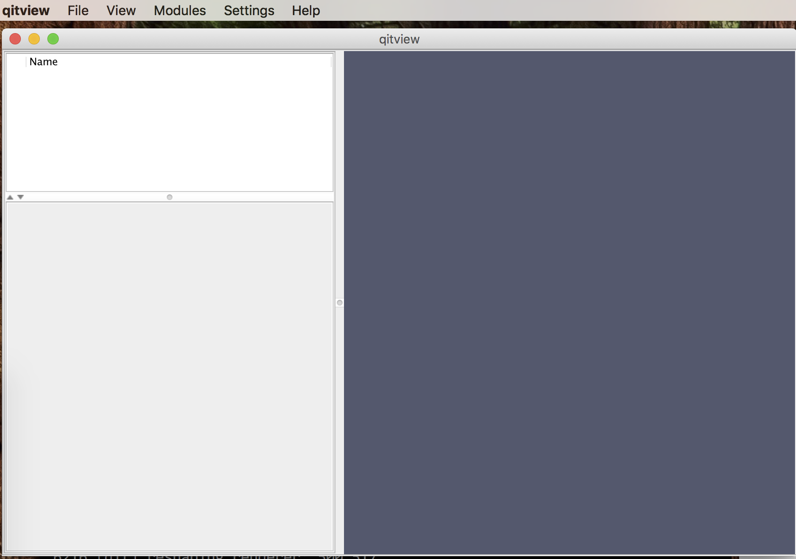
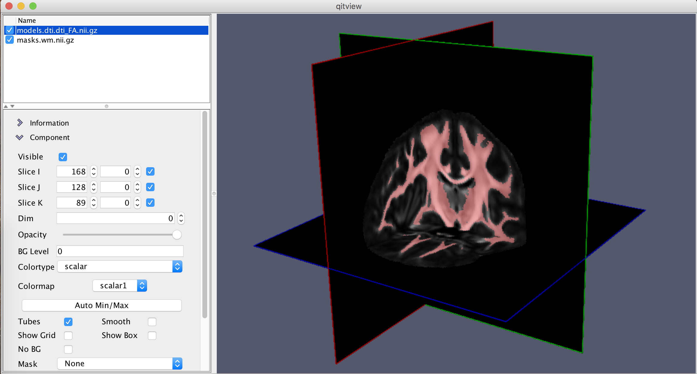
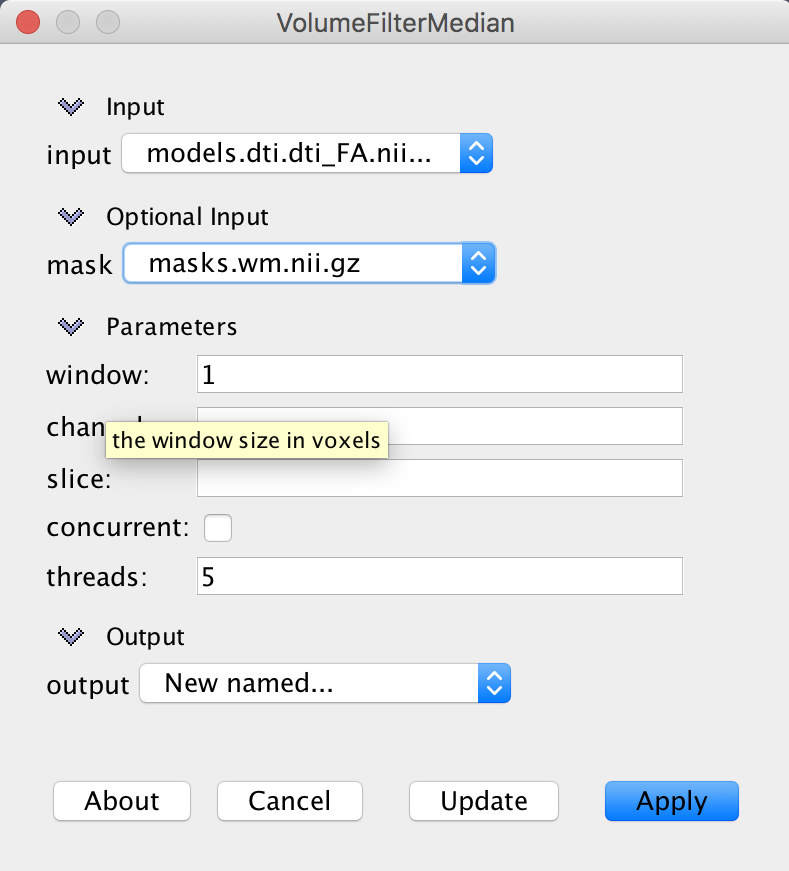
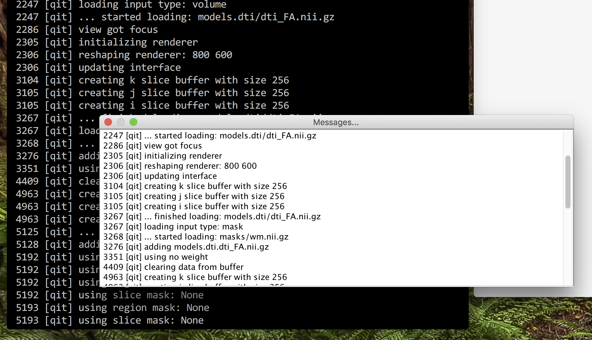

# Quickly getting QIT up and running 

This page provides some tips for getting quickly up to speed with using QIT on
the command line and the viewer. 

## Starting the Command Line

This section will help you get started with the toolkit's command line interface.  This can help you script various parts of your data analysis when you have a complex workflow, or you want to make your process reproducible.

## Main Interface

The command line interface to the toolkit can be accessed through a single program named `qit`.  There are a few global options available, which can be listed by running `qit --help`.  These most important ones are the following:

- `--verbose`: print messages about progress
- `--debug`: print debugging information when an error occurs
- `--rseed value`: specify a random seed

There are many modules for processing data that can be accessed through this interface.  You can get a list of available modules by running `qit --list`.  Once you find one that might be useful, you can learn more about it by adding it to the `qit` command.  For example, if you are intent on thresholding a volume, you could run:

```
$ qit VolumeThreshold

Name:

  VolumeThreshold

Description:

  Threshold a volume to make a mask

Required Arguments:

  --input <Volume>

    input volume

  --output <Mask>

    output mask

Optional Arguments:

  --mask <Mask>

    mask

  --threshold <double>

    threshold value (Default: 0.5)

Author:

  Ryan Cabeen
```

Then, you can plug in your data to run the command, for example:

`$ qit VolumeThreshold --input volume.nii.gz --threshold 0.5 --output threshold.nii.gz`

## Handling file formats

One benefit of the toolkit is that it handles many file formats automatically.  In the above help page, you'll notice that the input and output flags only ask for `Volume` and `Mask` objects.  These could be NIFTI, VTK, or a variety of others.  There is a more comprehensive discussion of this in the page on  [[Datasets]].

## Scripting

You can use your favorite programs to write scripts using `qit`, but there is also a convenient Python scripting interface that is built-in.  This uses a Java implementation of Python called [http://www.jython.org Jython] to directly connect your script with the data objects available in the toolkit.  This is a advanced topic that will be described in later pages, but you can see and example script at `lib/modules/qit/VolumeBrainExtract.py`.

## Starting the Viewer

This section will help you get started with the toolkit's viewer, and with any luck, you'll be able to explore and visualize your data in no time!

## Starting the Program

The viewer is a single 3D rendering application named `qitview`.  If you followed the [[Installation]], you should only have to type this command in your terminal.  Then, the graphical interface will open and look like this:



There are three main components to the user interface:

- **Data Workspace** (''top left''): a list of data in your workspace
- **Control panel** (''bottom left''): Information and settings about the currently select data
- **Viewing Stage** (''right''): a 3D rendering of the data

There are also five menu options available:

- **File**: load and save data, take screenshots, etc
- **View**: toggle what is visible, move the camera, change the order of data objects, 
- **Modules**: a list of modules for processing data
- **Settings**: modify colormaps, change rending options, show/hide messages and interpreter
- **Help**: open up the user manual (what you're reading now)

Without data, this isn't very useful, so let's try that next!

## Loading data

Data can be loaded in two ways: either interactively through the GUI or on the command line when starting the program.  To load data in the GUI, select `File>Open>${filetype}`, where `${filetype}`, may be one of the available datatypes.  To load data on the command line, you list the files after a flag indicating the type.  For example, to load a volume named `volume.nii.gz` and a mask named `mask.nii.gz`, you would execute:

`$ qitview --volume volume.nii.gz --mask mask.nii.gz`



It can take some time to load large datasets, so it can take some time to show up in the data workspace.

Once that data is loaded, you can select it in the data panel.  This should populate the selection panel with various collapsable folders for working with that object.  If more than one object is selected, the first selection is the one shown in the panel.

## Interacting with data

The viewer is based on a 3D rendering engine.  You can imagine your datasets is sitting on a stage surrounding by lights and a camera through which you are viewing the scene.  When you interact with the viewing panel, you are either changing the pose of the camera or interacting directly with the selected data object.  Here are the basic mouse interactions for changing the camera:

- **Mouse Primary Button + Drag**: rotate the camera
- **Mouse Secondary Button + Drag**: zoom in the camera (translate it towards the stage)
- **Mouse Middle Button + Drag**: pan the camera (translate in orthogonal to the view)

If you only have one mouse button, you can also use keyboard options:

- **Mouse Primary Button + Control + Drag**: zoom in the camera
- **Mouse Primary Button + Shift + Drag**: pan the camera (translate in orthogonal to the view)

Again, the specific functions will depend on the datatype, and you can learn more in the [[Interaction]] section.

## Processing data

There are many modules available for processing data, and they are listed in Modules menu.  The modules are organized by the primary data type they operate on; however, many modules combine datatypes.  When you select a module, a window will open that will let you specify inputs, parameters, and outputs.  For example, the VolumeFilterMedian module will look like this:

{: style="height:50%;width:50%"}

Each module includes documentation, which can be shown by clicking the `About` button.  Each parameter also has a brief description that can be revealed by hovering the mouse over the parameter name, e.g. `window` shown above.

There are three options for output files:

- **Existing data object**: write output to an existing data object (this will delete anything that was previously stored there)
- **New...**: create a new data object for the output with a default name
- **New named...**: create a new data object for the output and prompt the user for the new name

## Checking progress

`qitview` produces a lot of messages, either about what you are currently doing or what is happening in the background.  These are all printed to the command line, so it can be helpful to make the console visible.  Alternatively, you can open a messages window by selecting `Settings>Messages...`.



## Saving your work

After you've explored and analyzed your data, there are several ways to save your work.  The simplest is to take a screenshot using `File>Take Screenshot (1x)...`.  This will prompt you for a filename and save the screenshot there.  The tool also supports high resolution screenshots, for example, at twice the resolution of the viewing window (2x).  You can also save the data objects from your analysis using `File>Save Selected File(s)`.  This will prompt you for a filename and save the selected data object there.  Once you have saved a data object, it will also remember the filename and save to the same place next time.  If you want to save the data object to a new place, you can instead select `File>Save Selected File(s) As...`.  If you loaded your data from a file, the input filename will be associated with the file for saving.  You will see a warning before overwriting an existing file (such as the original input), but the more adventurous user can disable such warnings by selecting `File>File clobbering`.  If you are more of a packrat, you can enable file backups by selecting `File>File backups`, which will rename the existing file with a timestamp before writing the new data.  Finally, if you just want to save everything, you can select `File>Save Entire Scene`, which will write everything to a single directory with some additional metadata about the scene.

