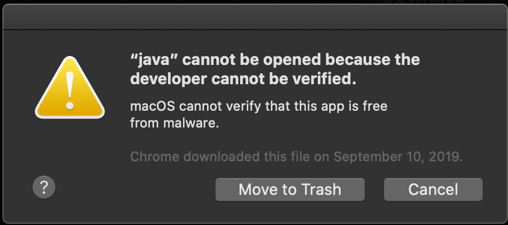
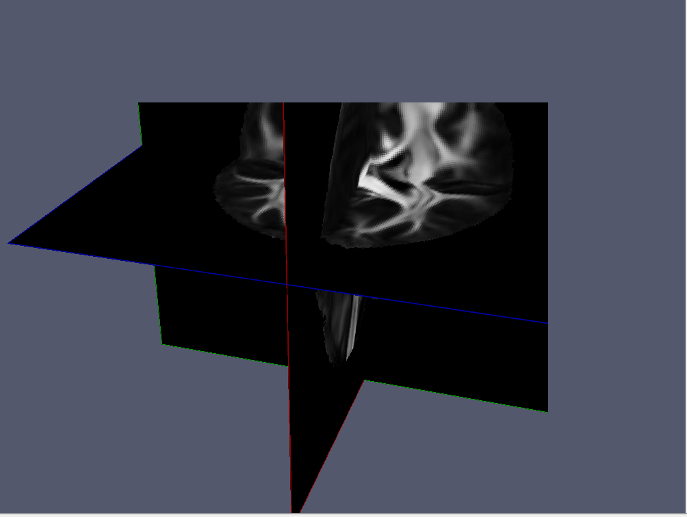

# How to get help using QIT

## Direct Support

I'm always happy to help answer questions about QIT, so please feel free reach
out via email to [cabeen@gmail.com](mailto:cabeen@gmail.com).  Otherwise, there are some frequently asked questions listed below that might help.

## Frequently Asked Questions

### Why do I get an error about developer verification on macOS?



On recent version of macOS, you may encounter the above error message about
developer verification for `java`.  This is due to increasing limitations on
running software distributed outside the App Store.  You can fix these
permissions issues by running this script bundled with QIT: 

`qit-build-mac-latest/bin/qitfixmac`

**Note:** you should select `Cancel` in the popup.  If you do happen to select
`Move to Trash`, this may corrupt the QIT installation, in which case you,
should re-install and try again.

### Why does `qitview` close immediately after opening it?

This is most likely because you have a 32-bit version of Java installed.
Imaging datasets can easily exceed the maximum memory allowed by a 32-bit
address space, so you should try installing a 64-bit version of Java.  On the
Java download page, 64-bit is usually named x64, and 32-bit is usually named
x86.

**Note:** The latest version of QIT includes a Java runtime, so you should try
downloading the latest version if you continue to have this problem. 

### Why did I get an error "Out of Memory Error (Java heap space)"?

This happens when you process a dataset that is larger than the available memory.  Each time `qit` and `qitview` is executed, a Java virtual machine is created with a given amount of available heap space for storing data.  The default amount is kept smallish at 2 gigabytes to avoid bogging down the system; however, you sometimes have to start it with more.  Here's an example command using 8 gigabytes instead:

`qit -Xmx8G VolumeCopy --input input.nii.gz --output output.nii.gz`

`8G` can be replaced with whatever other amount you like.  You can also specify other `-X` style flags supported by your system's Java virtual machine.

If that doesn't help, then you may have a huge dataset.  In that case, you can also switch the data precision.  By default the tools use double for all storage and processing, but you can change that to float instead:

`qit -Xmx8G --dtype float VolumeCopy --input input.nii.gz --output output.nii.gz`

This will cut the memory usage roughly in half, at the cost of some precision.  Mathematical operations will still be performed using double precision, but when things are saved back to volume, they will be in float.

### Why did I get an error about exceeding the heap size?

Some systems have a Java installation that limits the amount of memory available, particularly when a 32-bit version is installed.  qitview uses a heap of 4 gigabytes by default, which can often exceed that.  You can reduce the heap size, e.g. by adding "-Xmx1G" to the command; however, this may be too little to load your data.  The better option is to upgrade your Java installation to a newer 64-bit version.

### Why do I get an error about a missing main class?

You may have gotten one of the following errors:

```
Error: Could not find or load main class qitview.QitViewMain
Error: Could not find or load main class qit.main.QitMain
```

This is usually because you are executing the tools from the source directory instead of the installation directory.  You should check your paths to make sure the binary directory is `yourpath/qit-install/bin` and not `yourpath/qit-main/bin`.

### Why did my program print "error: null"?

This means the program had an error that was not well-documented.  This could be a bug or it could mean the input was incorrect.  It can be helpful to run the program with the verbose and debug flags, for example:

`qit --verbose --debug VolumeCopy --input input.nii.gz --output output.nii.gz`

This will give you very detailed information about the problem.  If you are still stumped or the output seems arcane, please ask around or forward it along as a bug report.

### How do I file a bug report?

Bug reports can improve the quality of the toolkit for everyone, so please don't hesitate to send them along.  At the moment, the best way is to just email me (Ryan).  If the error is on the command line, please include the stack trace of the error by running it with the verbose and debug flags, e.g.

`qit --verbose --debug VolumeCopy --input input.nii.gz --output output.nii.gz`

If it is a bug is the viewer, a screen capture can be helpful.  It is also useful to have a copy of the associated data and command to reproduce the problem, if they can be shared.

### Why is my data only showing up in the bottom left portion of the viewer?



This happens when you you use Java 9 on a HiDPI display on Windows (not sure about GNU/Linux).  This is a bug in either the JVM or JOGL, so we have to work around it.  One solution is to downgrade to Java 8; however, if you have a 4k display, the text will be very small, since Java 8 does not support interface scaling on Windows.  Alternatively, you can manually specify your display scaling factor by opening '''Advanced Settings''' menu item, expanding the '''Rendering''' panel, and entering your scaling factor.  You look up your scaling factor by searching for "Display" in the Windows search bar and then finding the setting listed under "Change the size of text, apps, and other items".

### Why doesn't X11 forwarding work?

If you are trying to use X11 forwarding on a Mac, you may have encountered the something like the following error:

```
libGL error: No matching fbConfigs or visuals found
libGL error: failed to load driver: swrast
Caught handled GLException: X11GLXDrawableFactory - Could not initialize shared resources for X11GraphicsDevice[type .x11, connection localhost:12.0, unitID 0, handle 0x0, owner false, ResourceToolkitLock[obj 0xb5f603a, isOwner false, <664d7475, 61e286b2>[count 0, qsz 0, owner <NULL>]]] on thread AWT-EventQueue-0-SharedResourceRunner
    [0]: jogamp.opengl.x11.glx.X11GLXDrawableFactory$SharedResourceImplementation.createSharedResource(X11GLXDrawableFactory.java:306)
    [1]: jogamp.opengl.SharedResourceRunner.run(SharedResourceRunner.java:353)
    [2]: java.lang.Thread.run(Thread.java:745)
Caused[0] by GLException: AWT-EventQueue-0-SharedResourceRunner: Error making temp context(1) current: display 0x7ff92c00b120, context 0x7ff92c03efa0, drawable X11OnscreenGLXDrawable[Realized true,
    Factory   jogamp.opengl.x11.glx.X11GLXDrawableFactory@23aa3d6e,
    Handle    0xc00002,
    Surface   WrappedSurface[ displayHandle 0x7ff92c00b120
, surfaceHandle 0xc00002
, size 64x64
, UOB[ OWNS_SURFACE | WINDOW_INVISIBLE ]
, X11GLXGraphicsConfiguration[X11GraphicsScreen[X11GraphicsDevice[type .x11, connection localhost:12.0, unitID 0, handle 0x7ff92c00b120, owner true, ResourceToolkitLock[obj 0x7a54e00c, isOwner true, <48ad288f, 5ad1a4e>[count 2, qsz 0, owner <AWT-EventQueue-0-SharedResourceRunner>]]], idx 0], visualID 0xf1, fbConfigID 0x83,
    requested GLCaps[rgba 8/8/8/0, opaque, accum-rgba 0/0/0/0, dp/st/ms 16/0/0, dbl, mono  , hw, GLProfile[GL2/GL2.sw], on-scr[.]],
    chosen    GLCaps[glx vid 0xf1, fbc 0x83: rgba 8/8/8/8, opaque, accum-rgba 0/0/0/0, dp/st/ms 24/0/0, dbl, mono  , hw, GLProfile[GL2/GL2.sw], on-scr[.]]]
, surfaceLock <779e16d8, 2a17cca7>[count 1, qsz 0, owner <AWT-EventQueue-0-SharedResourceRunner>]
, X11DummyUpstreamSurfaceHook[pixel 64x64]
, upstreamSurface false ]] on thread AWT-EventQueue-0-SharedResourceRunner
    [0]: jogamp.opengl.x11.glx.X11GLXContext.createImpl(X11GLXContext.java:393)
    [1]: jogamp.opengl.GLContextImpl.makeCurrentWithinLock(GLContextImpl.java:765)
    [2]: jogamp.opengl.GLContextImpl.makeCurrent(GLContextImpl.java:648)
    [3]: jogamp.opengl.GLContextImpl.makeCurrent(GLContextImpl.java:586)
    [4]: jogamp.opengl.x11.glx.X11GLXDrawableFactory$SharedResourceImplementation.createSharedResource(X11GLXDrawableFactory.java:277)
    [5]: jogamp.opengl.SharedResourceRunner.run(SharedResourceRunner.java:353)
    [6]: java.lang.Thread.run(Thread.java:745)
 1667 [qit] Profile GL2 is not available on null, but: []
```

This occurs when using a newish version of XQuartz.  For some (unknown) reason, versions 2.7.9 and greater do not play well with OpenGL.  You can resolve this issue by the following steps:

- Close XQuartz

- Open Terminal.app (inside Applications -> Utilities)

- Copy/paste the following commands into Terminal, and enter password where applicable.

- Run the following in the terminal:

```
launchctl unload /Library/LaunchAgents/org.macosforge.xquartz.startx.plist && \
sudo launchctl unload /Library/LaunchDaemons/org.macosforge.xquartz.privileged_startx.plist && \
sudo rm -rf /opt/X11* /Library/Launch*/org.macosforge.xquartz.* /Applications/Utilities/XQuartz.app /etc/*paths.d/*XQuartz && \
sudo pkgutil --forget org.macosforge.xquartz.pkg && \
rm -rf ~/.serverauth* && rm -rf ~/.Xauthorit* && rm -rf ~/.cache && rm -rf ~/.rnd && \
rm -rf ~/Library/Caches/org.macosforge.xquartz.X11 && rm -rf ~/Library/Logs/X11
```

- Download XQuartz 2.7.8 from [https://dl.bintray.com/xquartz/downloads/XQuartz-2.7.8.dmg](https://dl.bintray.com/xquartz/downloads/XQuartz-2.7.8.dmg) and install the package.

- Log out, and log back in.


