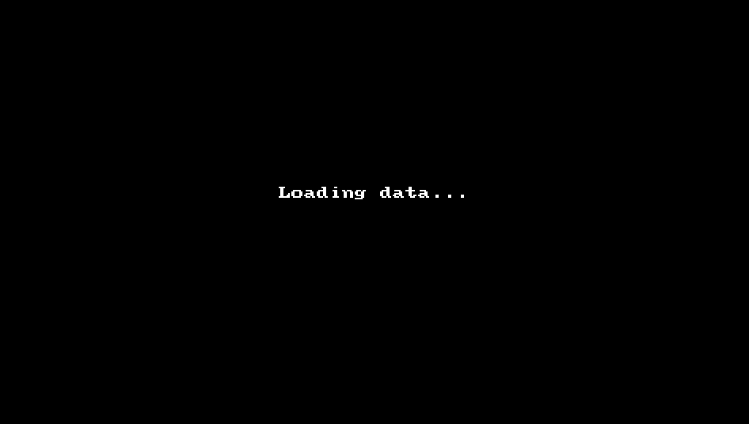
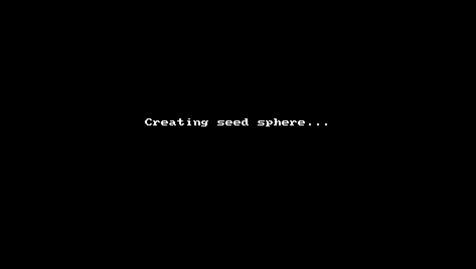
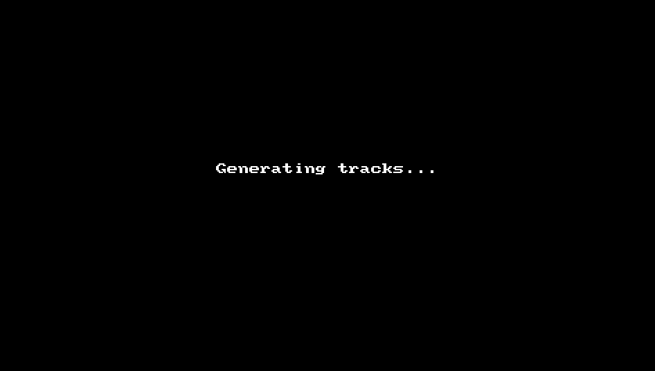
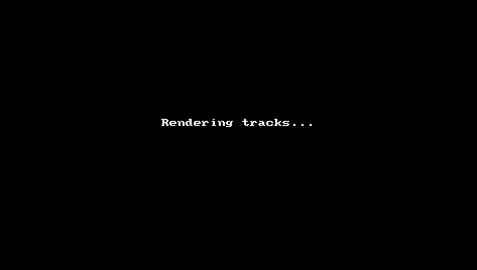
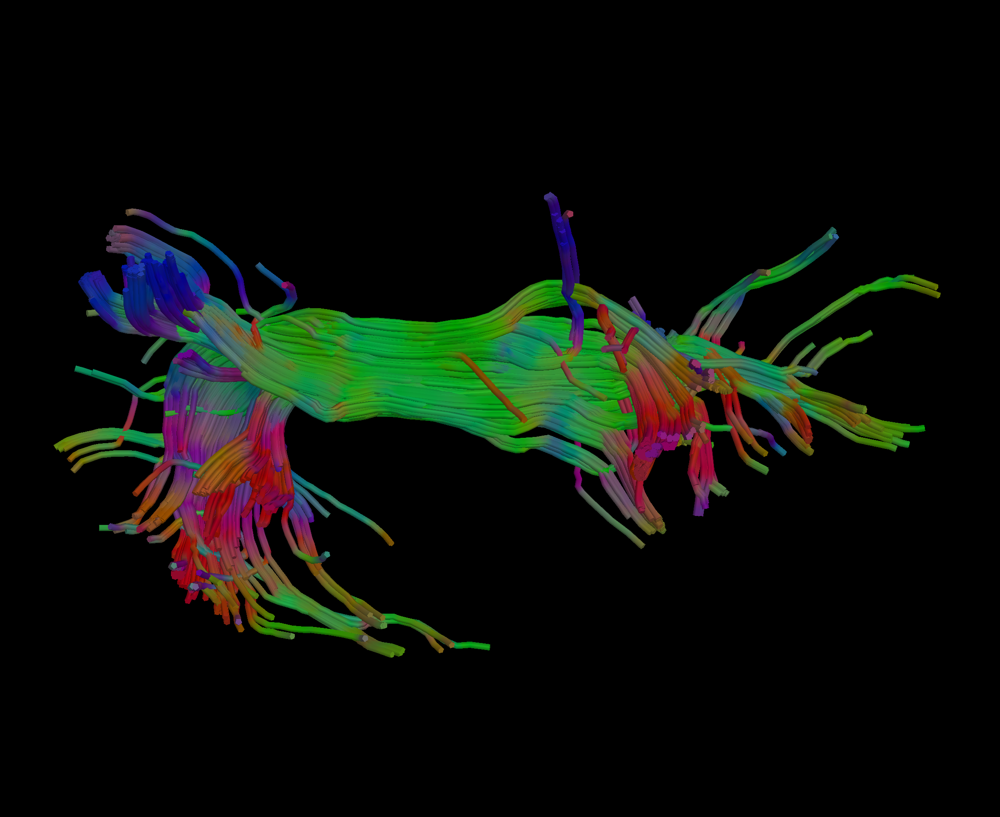

# Tractography Analysis with QIT

This page provides a tutorial for doing tractography with QIT.  The tutorial will show you how to extract a fiber bundle model of the arcuate fasciculus from a diffusion MRI dataset.  This will include glyph visualization, interactive seeding with a manually placed sphere, streamline integration, bundle isolation, and creating a high resolution rendering.  The [[Diffusion MRI Tutorial]]] provides some useful introductory material, and if you are new to tractography, you may want to go through that first.

## Setup

Before starting the tutorial, you'll need a few things.  First, we will make sure you have the necessary dependencies; then, we will download and install QIT; finally, we will download the sample data.  

## Installation

First, make sure you've installed QIT and its dependencies by following the [[Installation]] instructions.  You won't need the advanced dependencies for this tutorial, so you can skip that.

## Downloading the sample dataset

Next, we'll download the sample dataset, which is available here:

- [{: style="height:25px;width:25px"} Download dmri.tutorial.data.zip](https://github.com/cabeen/qit/releases/download/data-2021-03-21/dmri.tutorial.data.zip)

After you decompress the archive, you should find these files inside:

- `input/dwi.nii.gz`: a diffusion weighted MR image volume
- `input/mask.nii.gz`: a brain mask
- `input/bvecs.txt`: a b-vectors file
- `input/bvals.txt`: a b-values file
- `diff.models.dti`: a diffusion tensor volume directory
- `diff.models.xfib`: a ball and sticks volume directory
- `diff.models.fod.nii.gz`: a spherical harmonic FOD volume directory

There are other files in the archive, but the ones above are strictly required for the tutorial.  This dataset represents a basic 60 direction single shell diffusion MRI scan acquired on a 1.5T scanner.  The dataset is described in more detail [here](https://pdfs.semanticscholar.org/fce5/928fd4519747c642f379208e6779106e6256.pdf)

## Optional: Fitting models

Note: this section is not required for completing the tutorial.

The tutorial dataset provides diffusion model data (e.g. dti, fod, xfib) to expedite things, but if you want to repeat this analysis with your own data, you will have to fit these models yourself.  Below are the commands you can use for that:

```
$ qit VolumeTensorFit --input input/dwi.nii.gz --gradients input/bvecs.txt --mask input/mask.nii.gz --output diff.models.dti

$ qit VolumeFibersFitFsl --input input/dwi.nii.gz --gradients input/bvecs.txt --mask input/mask.nii.gz --output diff.models.xfib

$ qit VolumeSpharmFitMrtrix --input input/dwi.nii.gz --gradients input/bvecs.txt --mask input/mask.nii.gz --output diff.models.fod.nii.gz
```

There are many ways to adjust the model fitting, and the usage page will show you how to adjust those parameters.  For example, you can change the algorithm used for fitting, exclude certain scans/shells, or speed up the fitting with multiple threads.  Note: to run the above commands, you will have to install FSL and MRtrix. Please see the advanced section of the [[Installation]] page for more details.  They are only required for creating those files, so you can run the following tutorial without installing those 3rd party packages.

## Tutorial

Now that we have installed QIT and downloaded the sample data, we'll go over how to do tractography analysis.

## Loading data

Our first step is to load the input data.  You should open **File>Load Files** from the menu, click the **Add more files** button, select `diff.models.xfib`, and then click **Load files into workspace**.  After it has loaded, you can show the dataset by clicking the box next to its name and explore it to your liking.  Try to show only a coronal slice.
 


## Rendering glyphs

Next, we will visualize the diffusion models using glyphs.  First, select `diff.models.xfib`, then open the **Glyph Rendering** panel.  For the **Type**, select `Fibers` and then check the **Visible** box.  This should show some lines representing fiber orientations.  They are currently being cut by the background image slice , so you can nudge it by opening the **Slice Rendering** panel and incrementing the counter next to the slice index.  Then you can show better 3D glyphs by checking the **Ball**, **Sticks**, and **Glyph** checkboxes in the **Glyph Rendering** panel.  This should now depict the fiber volume fraction by the stick thickness and show a ball depicting the isotropic compartment.


## Creating a seed sphere

Next, we will create a sphere for interactive seed-based tractography.  You can add a sphere to the workspace by right clicking on `diff.models.xfib` and selecting the **Create Sphere** menu item.  This will create a sphere as big as the volume, so we need to shrink it and place near our bundle of interest.  You can resize it by clicking on it holding down **Alt+Shift** and dragging the mouse.  You can translate it by clicking on it while holding down **Alt** and dragging the mouse.  You can read more about this on the [[Interaction]] page.  You should try to position the sphere around the lateral green fibers of the arcuate, as shown in the video below:



## Generating tracks

Next, we will use the sphere for seed-based tractography.  First, you should open the **Modules>Seach...** menu item, and then find and open `VolumeModelTrackStreamline`.  Then, you should make sure the desired volume is selected as **input**, and then open the **Optional Input** panel and set the **seedSolids** to `seed`.  Then open the **Parameters** panel and change the **samples** to  `5000`.  This is the number of tractography curves initiated from inside the sphere.  Then you can select **Update** to run and leave the window open, or **Apply** to run it and close the window.  This should leave you with a `tracks` object in your workspace.  You can check the box to show it and rotate the view to see it from a lateral view.  At this point you can also hide the diffusion model volume by unchecking its box.



## Isolating Tracks

The bundle we have now includes the arcuate, but we need to isolate it from the others.  To do this, we will create a new spheres object (similar to before) and name it `include`.  We will use this to select the only the arcuate fibers from `tracks`.  You should resize and position the sphere in the anterior part of the arcuate, as shown in the animation below.  Then, we will set this sphere as an inclusion criteria.  You should make sure `tracks` is selected and then open the **Selection** panel.  You can then set the **Solids Include** combobox to `include`.  This will isolate the fibers in the frontal portion.  You can interactively move the sphere to see which fibers are included or excluded based on the position of the sphere.  We still have some stray fibers, so we will add another sphere to `include` by first selecting it in the workspace and then **Alt+Control** clicking on the bundle.  You can then resize and position the sphere to select the temporal portion.  Now, we should have mostly isolated the arcuate.  You can finalize these changes by opening the **Selection** panel of `tracks` and then selecting the **Retain Full Selection** button (this will delete all curves not in the selection).  You can then change the **Solids Include** to `None`, since we are no longer using it.


## Rendering Tracks

Finally, we will create a visualization of our tracks.  First, you should open the **Rendering** panel of the `tracks` object and select the **Tubes** checkbox.  Then, you can open the **Settings>Advanced Settings** menu item, open the **Rendering** panel, and change the background color to black.  Then you can position the curves to your liking and select the **File>Take Screenshot (2x)** to save a high resolution screenshot (twice the screen resolution).



Then you should have a PNG image of your bundle that is ready for your poster or publication:



## Conclusion

Congratulations! You've completed a basic tractography reconstruction from diffusion MRI data. Feel free to experiment with other modules and settings in qitview or ask around if you'd like to know more about what else you can do.  In particular, you can try the other diffusion model data, e.g. `diff.models.dti` and `diff.models.fod.nii.gz`.  The only modifications you have to make is the **Type** of glyph, which should be `Tensor` and `Spharm`, respectively.

